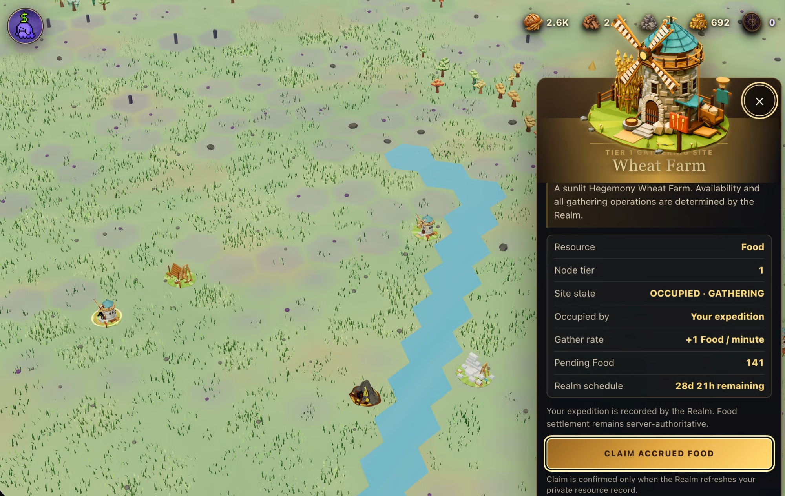

# Warpkeep

**[Warpkeep](https://warpkeep.com/) turns a Farcaster identity into a permanent castle in a shared strategy world that remembers you.**

## What is this?

Genesis 001 is a persistent, invite-only 10,000-cell Lowlands realm with 100 permanent castle sites kept close to its founding district. Each founder signs in with a verified Farcaster identity, receives one durable keep, and can privately collect four resources from its terrain: Food / Wood / Stone / Gold. Alpha 0.3.8 is live but early; exploration and the private resource loop work today, while the intended core strategy loop is not playable yet. Warpkeep is a one-person experiment—not a finished MMO or financial product; there are no token rewards, no financial promises, and joining does not earn an airdrop or financial return or guarantee a reward or future value.



*Development preview from the procedural grass and wind draft; this visual layer is not part of live Alpha 0.3.8 yet.*

## Quick start

Prerequisites: Git, Node.js 22, and npm.

```sh
git clone https://github.com/ael-dev3/Warpkeep.git
cd Warpkeep
npm ci
npm run dev
```

Open the local URL Vite prints; shared Alpha access stays off by default. Run
the contributor checks in [CONTRIBUTING.md](CONTRIBUTING.md), and use the
[documentation guide](docs/README.md) for system-specific setup. Asset
reconstruction is not part of a normal build; read
[asset provenance](ASSETS-LICENSE.md) before working with protected source
packages.

## Current status

| State | Today |
| --- | --- |
| ✅ Live | Alpha 0.3.8 is live and invite-only. |
| ✅ World | Genesis 001 persists 10,000 cells and keeps 100 permanent castle sites near the founding district. Founders return to one durable keep, explore the Lowlands, and inspect nearby founders through their public username / portrait / castle. The same authoritative world waits across sessions. |
| ✅ Authority | FID is the durable identity; handles and portraits are bounded presentation metadata. Farcaster sign-in uses a browser-bound, least-privilege bridge. The browser presents. The server decides admission and ownership. It also owns resources, timers, and saved state. |
| ✅ Resources | Each keep privately collects Food / Wood / Stone / Gold from authoritative terrain. The browser never invents balances. |
| ✅ Marks | Community Marks are separate private accounting and start at zero. They cannot be spent, converted, or transferred. They have no cash value, promised utility, or reward loop. The world, rules, and direction will evolve. |
| 🚧 In progress | Resource nodes, expeditions, environmental detail, and stronger founder tooling are being explored in draft branches. Draft work is not live. |
| 📋 Planned | Resource nodes; construction and upgrades; units / scouting / travel / combat; alliances / trading / chat; seasons / governance / rewards. Design notes are experiments, not promises that these features will ship unchanged. |

## Tech stack

- **React** — Keeps interactive interface components manageable.
- **TypeScript** — Makes shared data contracts explicit.
- **Vite** — Builds the browser client quickly.
- **Three.js / WebGL** — Renders the Lowlands in browsers.
- **Responsive CSS** — Supports phones, keyboards, and fallbacks.
- **Farcaster Auth** — Connects castles to verified identities.
- **Cloudflare Workers** — Verifies sign-in with least privilege.
- **SpacetimeDB** — Owns Realm and player state.
- **Vitest** — Catches regressions across critical boundaries.

## Links

- **Architecture:** The [technical architecture](docs/technical-architecture.md) explains what the browser shows and what the server decides.
- **Documentation:** The [documentation guide](docs/README.md) points to the current product, development, security, and operations material.
- **Roadmap:** The [roadmap](docs/design/roadmap.md) and [game direction](docs/design/warpkeep-direction.md) separate today's game from later plans.
- **Authentication:** The [Farcaster integration](docs/farcaster-integration.md) guide covers sign-in, privacy, and public configuration.
- **Release history:** The [changelog](CHANGELOG.md) summarizes player-facing releases; [GitHub Releases](https://github.com/ael-dev3/Warpkeep/releases) retain fuller notes.
- **Licensing:** [LICENSING.md](LICENSING.md) explains release rules; [asset provenance](ASSETS-LICENSE.md) records where media came from and what permissions apply.
- **Contributing:** [CONTRIBUTING.md](CONTRIBUTING.md) covers checks and provenance; the [Realm Council issue forms](https://github.com/ael-dev3/Warpkeep/issues/new/choose) accept privacy-safe bugs and ideas.
- **Security:** Report sensitive issues privately through [SECURITY.md](SECURITY.md), never through a public issue.
- **Community:** Play at [warpkeep.com](https://warpkeep.com/), join the [Warpkeep channel on Farcaster](https://farcaster.xyz/~/channel/warpkeep), and explore the [provenance-tracked visual archive](https://github.com/ael-dev3/Warpkeep-Assets).

## License

Warpkeep software uses Apache-2.0; authorized project-owned creative work follows the recorded CC-BY terms, while some GameReady runtime assets have narrower permissions and no general open-content or derivative license—read [LICENSING.md](LICENSING.md) and [ASSETS-LICENSE.md](ASSETS-LICENSE.md) before reuse.
