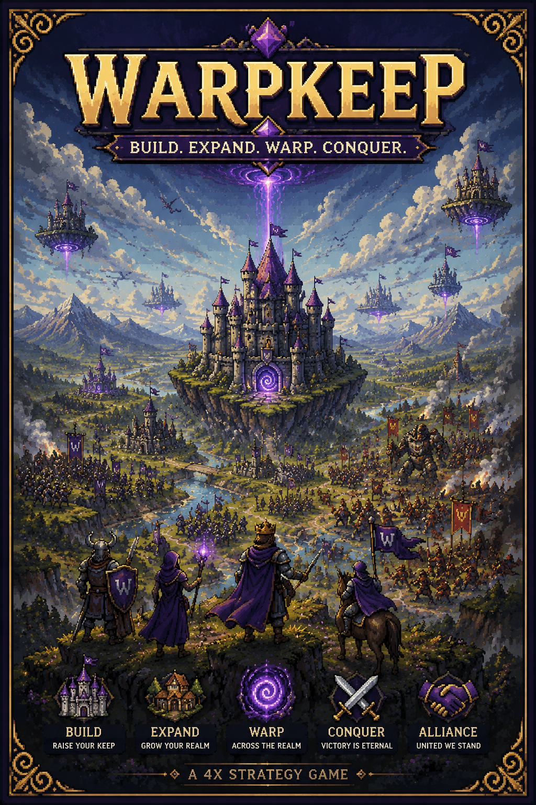
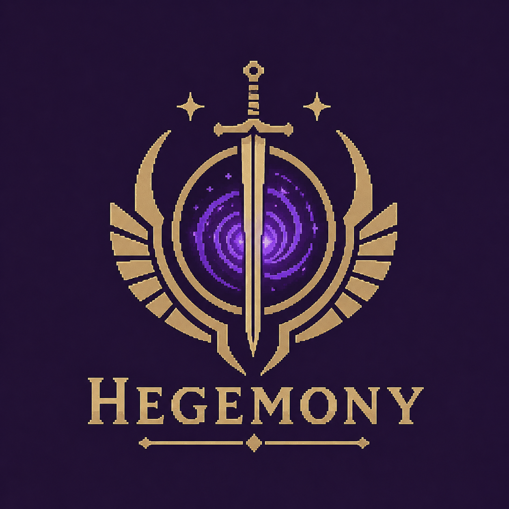
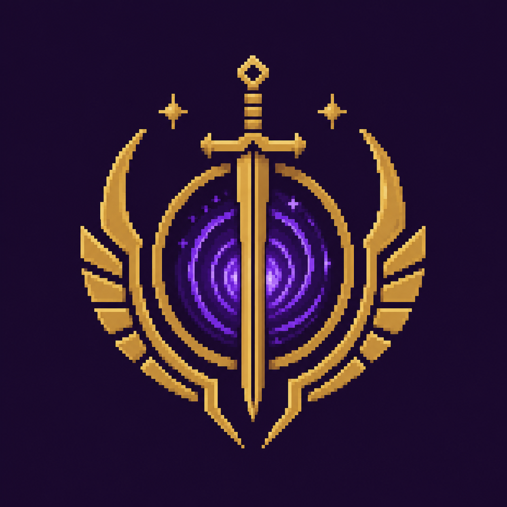

# Warpkeep

**Every FID has a castle.**

Warpkeep is an open-source Farcaster-native strategy game where each player can claim a keep, build a realm, and participate in seasonal conflicts.

**Live demo:** https://ael-dev3.github.io/Warpkeep/

Current public prototype: the live demo opens on a pure Three.js **WARPKEEP** title screen built around custom continuous architectural letterforms, a slowly rotating five-arm galaxy, and an accessible eye-like gravitational gateway. Activating the galactic core pulls the scene through a violet warp passage into a live Hegemony main menu. `ENTER REALM` starts standard website Sign In with Farcaster: the browser creates a channel with the official Farcaster Auth relay, immediately exposes the returned official universal link, polls for approval, verifies the signed message, and exposes the verified FID/profile to the prototype. Desktop is QR-first; a narrow touch/coarse mobile layout is deep-link-first so a player opens Farcaster instead of scanning their own screen, with QR as an optional fallback. By default the player may remember a minimal public identity record on this browser for 30 days; that record is visibly classified as a local prototype convenience and is never production authentication. An anonymous direct, refreshed, or history-restored `#realm` route is normalized to `#menu`, while an unexpired remembered-device record may re-enter the client-only realm directly. After identity confirmation, the Realm opens a bright Hegemony Lowlands scene with **61 playable radius-four cells** and a **30-cell noninteractive visual apron**, for **91 rendered cells** in total. Deterministic grass, dry vegetation, and stones surround a fixed center-cell 3D Frontier Keep personalized to the verified username/FID. The authenticated Lowlands have their own stream-copied “Lowlands of Hegemony” score, using a measured equal-power loop and title/menu/realm crossfades. A smoothly morphing perspective camera moves from the realm overview into a close gate view by wheel, pinch, or the Inspect Keep action. This is not a persistent game loop yet; permanent keeps, resources, units, combat, trusted persistence, and SpacetimeDB remain future work.

Warpkeep is a Farcaster-native asynchronous strategy game seed intended to let every Farcaster FID map to a persistent castle profile once trusted game authority exists. It is inspired by old-school asynchronous strategy loops like building, training, scouting, raiding, alliances, and seasonal realm politics, but it is designed as an original Farcaster-native game foundation.

<p align="center">
  
</p>

<p align="center">
  <em>Build, expand, warp, and conquer across a fantasy realm of shifting keeps and distant wars.</em>
</p>

Warpkeep aims for the feel of a grand fantasy 4X strategy game: vast realms, distant battles, player-built keeps, alliances, conquest, and magical warping across the map.

Current status: **presentation, verified browser identity, remembered-device prototype convenience, and early deterministic realm-terrain prototype**. The repository also contains a local mocked castle dashboard and deterministic state scaffold for development, but that dashboard is not exposed by the public menu. A remembered device record is browser-controlled and not authority for permanent keep ownership. SpacetimeDB, gameplay, trusted persistence, and server-issued sessions are planned, not complete.

## Current direction

Warpkeep's direction is an open-source Farcaster-native strategy game where each player can eventually claim a keep, build a realm, and participate in seasonal conflicts. The first direction is a small Hegemony-versus-Core campaign focused on castle progression, PvE battles, public reports, and social strategy. Long-term, Warpkeep is intended to support Ousters as a second human faction, community realms, forkable rules, and player-driven Farcaster-native stories.

Long-term, Warpkeep may explore distinct faction economies: a regulated Hegemony economy using official faction currency rails such as Hypersnap `$SNAP`, and an Ouster economy based on player-to-player trade and social trust. This is experimental/post-MVP and not part of the initial playable scope.

Read more:

- [`docs/design/warpkeep-direction.md`](docs/design/warpkeep-direction.md)
- [`docs/design/hegemony-lowlands-terrain.md`](docs/design/hegemony-lowlands-terrain.md)
- [`docs/design/lowlands-audio.md`](docs/design/lowlands-audio.md)
- [`docs/design/roadmap.md`](docs/design/roadmap.md)
- [`docs/reference/castles/`](docs/reference/castles/) — archived castle art-direction references

## Official faction art

<p align="center">
  
</p>

<p align="center">
  
</p>

The Hegemony wordmark is the official high-resolution faction logo for public docs and faction identity surfaces. The textless version is the official in-game UI logo for compact badges, cards, and small interface use.

See [`docs/reference/factions/hegemony/`](docs/reference/factions/hegemony/) for asset metadata.

## Concept

A Farcaster-native strategy game where your FID becomes a kingdom.

The current public experience:

1. A cinematic **WARPKEEP** title screen establishes the cosmic world.
2. Click/tap the central gateway, or press Enter/Space, to enter the Hegemony menu through a gateway-centered transition.
3. **Enter Realm** explicitly opens Warpkeep's standard web Farcaster sign-in rail; no auth channel or QR is created on the title screen, initial page load, or ordinary direct `#menu` load. Desktop requests a QR; mobile/coarse layouts lead with the official Farcaster link and only load a QR if asked.
4. An anonymous direct, refreshed, Back, or Forward visit to `#realm` never mounts the realm. It is replaced with `#menu`, opens the same authentication rail, and retains Realm as the pending destination until the player cancels, returns to title, signs out, or enters the realm after verification.
5. Scan with Farcaster, use **Open Farcaster** on a mobile website, or select **Show QR instead** when needed. Warpkeep verifies the signed message and matching FID before showing identity confirmation. The default 30-day remembered-device option persists only a public identity/display subset, never SIWF proof material.
6. Authenticated **Enter Realm** opens the deterministic Hegemony Lowlands slice: 61 playable pointy-top cells inside a seamless 91-cell rendered landscape, with a noninteractive outer apron, bright daylight, profile-scaled terrain and instanced details, smooth overview-to-gate camera controls, and the session-personalized Frontier Keep fixed at `0,0`. The SVG fallback preserves the same map split and fixed keep, while a collapsed 61-cell navigator retains semantic keyboard and screen-reader access. Lowlands music is loaded only after authenticated realm preparation.
7. Continue, Settings, Credits, and Exit retain their honest development notices.
8. Return to Menu, Escape, and browser Back preserve the title/menu history path without a page reload.
9. The local mocked castle dashboard remains a future-development scaffold and is not a playable public destination.

## Local development

```bash
npm install
npm run dev
npm test
npm run typecheck
npm run build
GITHUB_PAGES=true npm run build
npm audit
```

For a real relay check, run `npm run dev`, reach the Hegemony menu, select `ENTER REALM`, and approve the QR/deep link in a Farcaster client. Unit tests use injected clients and never contact the live relay. Do not publish a live QR, raw relay response, console dump, or HAR file: those may expose active channel or proof material. See [`docs/farcaster-integration.md`](docs/farcaster-integration.md) for the complete security boundary and QA checklist.

## Architecture overview

- Vite + React + TypeScript frontend.
- Deterministic game logic in `src/game/systems/gameLoop.ts`.
- Renderer-independent axial terrain generation in `src/game/map/` with a direct Three.js realm surface in `src/components/realm/`.
- Models in `src/game/models/types.ts`.
- Standard web SIWF authority, typed state machine, and proof-free React view state in `src/farcaster/`.
- Custom Hegemony QR/identity presentation in `src/components/auth/`; no stock auth modal is used.
- Mock nearby castles in `src/game/mockData/mockCastle.ts`.
- SpacetimeDB schema/reducer direction in `src/spacetime/schemaDraft.ts` and `docs/spacetime-db-plan.md`.
- AI court report interface in `src/ai/courtReport.ts`.

## Design Principles

1. Every FID has a castle.
2. Deterministic mechanics first, AI flavor second.
3. Server-authoritative multiplayer state.
4. Desktop-first strategic experience.
5. Farcaster-native identity and social graph.
6. No fragile on-chain execution.
7. No pay-to-win foundation.
8. Small seed now, expandable world later.

## What is implemented now

- Current Three.js title-screen experiment with unified custom brutalist glyph outlines, refined load-bearing W and K silhouettes, deeply extruded premium ivory concrete, optical wordmark spacing, pointer-responsive physical lighting, and a large slowly rotating and gradually growing five-arm galaxy. Its integrated eye-lens gateway layers sharp reflective violet ribbons, filamentary energy, GPU residue, local galaxy/star distortion, adaptive quality, reduced-motion handling, a lightweight matching fallback, and controlled activation choreography.
- Reducer-driven title → menu → title flow with a gateway-origin warp veil, Three.js camera pull, five-second entry hint, global Enter/Space shortcuts, history/hash support, focus restoration, and a short reduced-motion path.
- Hegemony main-menu prototype with live HTML/CSS typography and commands over a responsive clean 1080p no-audio castle film, color-matched poster fallback, title/menu/realm equal-power audio scenes, measured OST loop overlaps, unique anchored notices, and keyboard/touch behavior.
- On-demand standard web Sign In with Farcaster from `ENTER REALM`, backed by `@farcaster/auth-client`, `viem`, the official relay, and a custom `qrcode` rendering path. Desktop is QR-first while mobile uses the same validated relay URL as the deep-link-first route; the verified FID is the stable prototype identity key and usernames/profile images are display metadata only.
- A renderer-independent radius-four Hegemony Lowlands gameplay map with 61 selectable cells, plus a separately derived radius-five render surface whose 30-cell visual apron brings the seamless terrain total to 91 cells without entering gameplay or accessibility state. High, compact, and reduced profiles use 8/5/3 subdivisions per edge (34,944 / 13,650 / 4,914 terrain triangles), bounded pixel ratios, profile-scaled fog and decoration density, and dynamic shadows only on high.
- Brighter edge-safe procedural lowland color, a smoothly flattened packed-earth center footprint, and three deterministic instanced detail layers for olive grass, dry-gold vegetation, and stones. A single damped `PerspectiveCamera` transitions from a clamped strategic overview to a lower close gate view with wheel and touch-pinch zoom, Inspect Keep, Realm View, Recenter Keep, and reduced-motion settling.
- Two exact lazy-loaded Meshopt/WebP Frontier Keep LODs selected before loading: [`public/models/hegemony/hegemony-frontier-keep-high.glb`](public/models/hegemony/hegemony-frontier-keep-high.glb) is 2,256,092 bytes, 56,466 triangles, and uses 2K textures; [`public/models/hegemony/hegemony-frontier-keep-compact.glb`](public/models/hegemony/hegemony-frontier-keep-compact.glb) is 760,916 bytes, 17,536 triangles, and uses 1K textures. Both normalize to 74% of the center hex diameter; the unchanged 63,263,296-byte source archive is never served to title, menu, or authentication flows.
- A compact identity-aware HUD and collapsed 61-cell navigator replace the permanent coordinate matrix. The fixed center keep displays the verified `@username`/FID and Level 1 with player-facing territory status; it is neither movable nor persisted. WebGL and model-load failures retain the realm through illustrated and primitive fallbacks.
- Public menu destinations are presentation-only; they do not expose gameplay or the local mocked dashboard.
- Local development scaffold includes a castle dashboard with player identity, buildings, resources, queues, nearby castles, court report, and activity log.
- Deterministic resource collection, upgrade queue, training queue, and scouting report functions.
- Vitest tests for the core game loop.
- Product and architecture docs for Farcaster, SpacetimeDB, game design, and future agents.

## What is intentionally not implemented yet

- Trusted backend-issued authentication sessions and permanent keep ownership.
- Real SpacetimeDB module or hosted multiplayer backend.
- Combat or raid resolution.
- Token mechanics.
- A complete production art pipeline beyond the reproducible first-keep LOD process.
- AI-generated state changes.

## Design references

- Official faction logos and metadata are archived under `docs/reference/factions/`.
- Castle reference art is archived under `docs/reference/castles/` for future visual direction.
- Terrain and tile reference art is archived under [`docs/reference/terrain/`](docs/reference/terrain/) for future procedural-surface direction.
- The Hegemony main-menu source archive and runtime-media provenance are recorded under [`docs/reference/menu/2026-07-10/`](docs/reference/menu/2026-07-10/).

## SpacetimeDB direction

SpacetimeDB should become the authoritative multiplayer/game-state backend for players, FIDs, castles, resources, buildings, queues, units, scouting, raids, alliances, seasons, world events, diplomacy, and activity logs.

Read `docs/spacetime-db-plan.md` before implementing multiplayer.

## Farcaster authentication boundary

`ENTER REALM` opens a standard website SIWF flow. Warpkeep uses the official public relay at `https://relay.farcaster.xyz`, `@farcaster/auth-client`, `viemConnector` with the public Optimism RPC at `https://mainnet.optimism.io`, and `qrcode`. The canonical SIWF URI is derived from the current origin plus Vite's base path: localhost uses the local origin root, while the Pages build uses `https://ael-dev3.github.io/Warpkeep/`. Menu hashes are never part of the signed URI. Desktop presents a QR first; narrow coarse/touch-capable mobile layouts use the validated relay-returned Farcaster universal link first and keep QR as a manually requested fallback.

The verified FID is the stable identity key. Username, display name, avatar, custody address, and verification-address lists are profile/display data, not ownership proof. Fresh SIWF verification is marked `live-client-verified`. With the default remember option, Warpkeep may retain only `fid`, optional username/display name/profile URL, and verified/remembered/expiry timestamps for 30 days in an origin/base-path-bound local prototype record. A restored record is marked `remembered-device-prototype`, is visibly distinguished from a fresh proof, and can open the current client-only `#realm` without a new channel. An absent, invalid, expired, or signed-out record takes the ordinary `#menu` gate; the realm hash itself is never accepted as authority.

Warpkeep does not implement a Farcaster Mini App, Quick Auth, wallet connection, transactions, or a server-issued persistent session. Outside the relay-returned URL required for the QR/deep link, the standalone channel token and nonce are not separately rendered; token, URL, QR data, nonce, request ID, SIWF message/signature, custody address, verification addresses, and auth method are never written to the remembered record, app history, or logs. Terminal states and cancellation clear the controller's private references and ignore late results. The SDK exposes no abort signal, so an already in-flight call may retain its local request material until it settles. `localStorage` is browser-controlled and spoofable: this client-only milestone can gate prototype UI, but it cannot authorize permanent keeps, resources, combat, rankings, or SpacetimeDB writes.

Read [`docs/farcaster-integration.md`](docs/farcaster-integration.md) for implementation details, local/Pages configuration, testing, and the trusted-backend migration path.

## Future roadmap

- Replace browser-only verification with a trusted backend-issued Secure HttpOnly SameSite session.
- Implement SpacetimeDB module tables and reducers.
- Add generated TypeScript client bindings.
- Move timers and resource calculations server-side.
- Add alliance and diplomacy systems.
- Design combat before implementing raids.
- Add seasons and reset mechanics.
- Add AI court reports, battle reports, lore, and shareable Farcaster cards as read-only flavor layers.

## Viewing the prototype

Run `npm run dev` and open the local Vite URL. The normal route opens the title; `#menu` opens the media-resilient menu directly for development and accessibility testing.

## License

Warpkeep is licensed for maximum reuse freedom:

- Software code: Zero-Clause BSD (`0BSD`). See [`LICENSE`](LICENSE).
- Documentation, lore, manifests, and project-owned media/reference assets: CC0 1.0 Universal unless a file says otherwise. See [`LICENSE-CC0`](LICENSE-CC0) and [`ASSETS-LICENSE.md`](ASSETS-LICENSE.md).

These licenses allow broad copying, modification, redistribution, private use, commercial use, forks, mods, alternate clients, and community realms. They do not grant trademark rights or imply endorsement by the official Warpkeep project.
