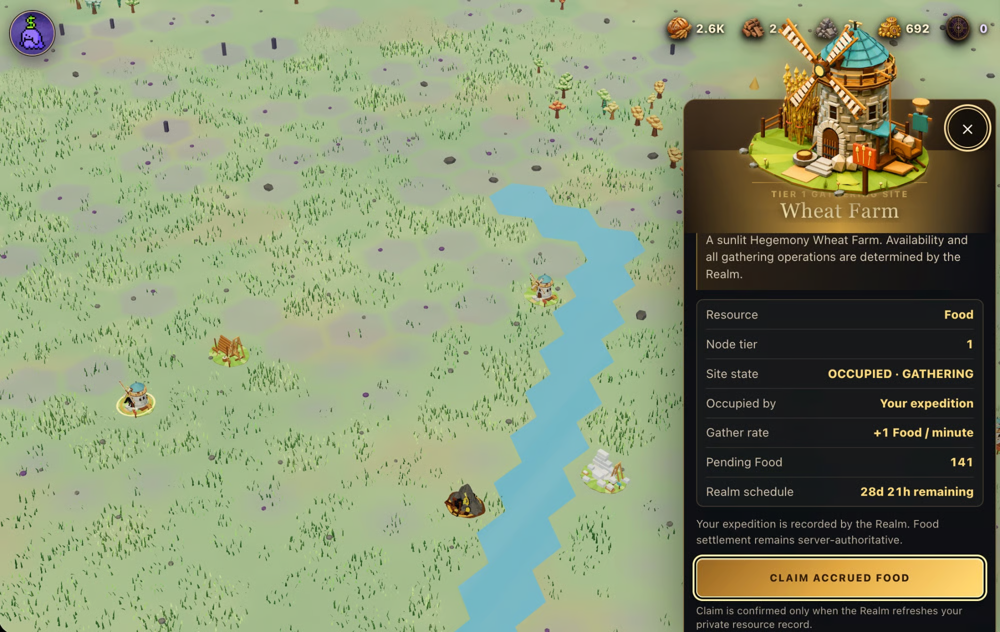

# Warpkeep

**[Warpkeep](https://warpkeep.com/) turns a Farcaster identity into a permanent castle in a shared strategy world that remembers you.**

## What is this?

Genesis 001 is a persistent, invite-only 10,000-cell Lowlands realm with 100 permanent castle sites gathered near its founding district. Each admitted founder enters through a verified Farcaster identity, receives one durable keep, and returns to a world that remembers its coastline, twelve rivers, wintering north, sunscoured south, shaped forests, resource sites, Workers, wagons, and public keeper portraits. Four permanent Workers can gather Food / Wood / Stone / Gold, settle production automatically, and return home on command.

Alpha 0.3.33: The Realm now records one experimental Community Mark for each admitted keeper per eligible day. Returning admitted players with current Alpha Terms enter directly in ordinary browsers and the portrait-first Farcaster Mini App; verified players still outside the gate can place one private request for manual review. The intended core strategy loop is not playable yet: Warpkeep is a one-person, open-source experiment—not a finished MMO or financial product. Participation earns no token reward, airdrop, financial return, guaranteed reward, or future value.



*Development preview of the Realm Wheat Farm inspection flow; this documentation image does not itself activate or authorize gameplay.*

## Quick start

Prerequisites: Git, Node.js 22, and npm 10.

```sh
git clone https://github.com/ael-dev3/Warpkeep.git
cd Warpkeep
npm ci
npm run dev
```

Open the local URL Vite prints; shared Alpha access stays off by default. Contributor checks live in [CONTRIBUTING.md](CONTRIBUTING.md), authentication setup lives in the [Farcaster integration](docs/farcaster-integration.md) guide, and deeper setup lives in [reconstruction and recovery](docs/operations/reconstruction/README.md). Asset reconstruction is explicit and not part of a normal build; read [asset provenance](ASSETS-LICENSE.md) before working with protected source packages.

## Current status

| State | Today |
| --- | --- |
| ✅ Live | Alpha 0.3.33: The Realm Remembers is live and invite-only in browsers and the Farcaster Mini App. |
| ✅ World | Genesis 001 persists 10,000 cells, a coastline, twelve one-cell rivers, colder northern and drier southern frontiers, and 100 permanent castle sites near the founding district. Founders return to one durable keep, explore the Lowlands up to its fog, and inspect nearby founders through their public username / portrait / castle. |
| ✅ Authority | FID is the durable identity; handles and portraits are bounded presentation metadata. Farcaster sign-in uses a browser-bound, least-privilege bridge. The browser presents; the server decides admission, ownership, resources, timers, and saved state. A private access request asks for manual review and grants nothing by itself. |
| ✅ Resources | Each keep privately holds Food / Wood / Stone / Gold. Food, Wood, and Stone come from authoritative terrain yield and can also be gathered at Wheat Farms, Logging Camps, and Stone Quarries; Gold comes from Gold Mines. Completed yield settles without a Claim step, and occupied sites keep their gathering story in one record. The browser never invents balances. |
| ✅ Marks | Each admitted keeper receives one experimental Community Mark per eligible Realm day through private, replay-protected SpacetimeDB authority. Marks require no wallet or token action and cannot be spent, converted, redeemed, or transferred. They have no cash value, promised utility, or reward loop. |
| 🚧 In progress | Worker journeys now begin on the map, but the larger construction, strategy, and social loops are still being built. |
| 📋 Planned | Construction and upgrades; units / scouting / travel / combat; alliances / trading / chat; seasons / governance. Design notes are experiments, not promises that these features will ship unchanged. |

## Tech stack

- **React** — Keeps interactive interface components manageable.
- **TypeScript** — Makes shared data contracts explicit.
- **Vite** — Builds the browser client quickly.
- **Three.js / WebGL** — Renders the Lowlands in browsers.
- **Responsive CSS** — Supports phones, keyboards, and fallbacks.
- **Farcaster Auth** — Connects castles to verified identities.
- **Cloudflare Workers** — Verifies sign-in with least privilege.
- **SpacetimeDB** — Owns Realm and player state.
- **Vitest** — Catches regressions across critical boundaries.

## Links

- **Architecture:** The [technical architecture](docs/technical-architecture.md) explains what the browser shows and what the server decides.
- **Roadmap:** The [roadmap](docs/design/roadmap.md) and [game direction](docs/design/warpkeep-direction.md) separate today's game from later plans.
- **Authentication:** The [Farcaster integration](docs/farcaster-integration.md) guide covers sign-in, privacy, and public configuration.
- **Release:** The [Alpha 0.3.33 release notes](CHANGELOG.md#0333--2026-07-31) describe daily Community Marks.
- **Licensing:** [LICENSING.md](LICENSING.md) explains release rules; [asset provenance](ASSETS-LICENSE.md) records where media came from and what permissions apply.
- **Contributing:** [CONTRIBUTING.md](CONTRIBUTING.md) covers checks and provenance; the [Realm Council issue forms](https://github.com/ael-dev3/Warpkeep/issues/new/choose) accept privacy-safe bugs and ideas.
- **Security:** Report sensitive issues privately through [SECURITY.md](SECURITY.md), never through a public issue.
- **Quality:** The [verification checklist](docs/operations/reconstruction/verification-checklist.md) covers desktop / phone / keyboard / touch / reduced-motion / fallback checks.
- **Community:** Play at [warpkeep.com](https://warpkeep.com/), join the [Warpkeep channel on Farcaster](https://farcaster.xyz/~/channel/warpkeep), and explore the [provenance-tracked visual archive](https://github.com/ael-dev3/Warpkeep-Assets).

## License

Warpkeep software uses Apache-2.0; authorized project-owned creative work follows the recorded CC-BY terms, while some GameReady runtime assets have narrower permissions and no general open-content or derivative license—read [LICENSING.md](LICENSING.md) and [ASSETS-LICENSE.md](ASSETS-LICENSE.md) before reuse.
