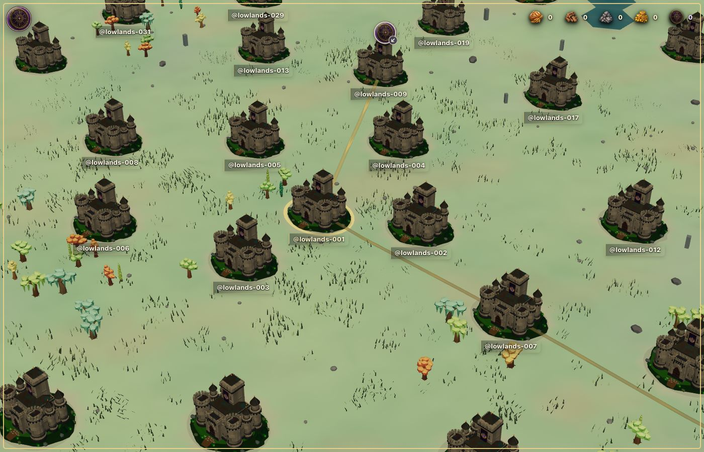

# Warpkeep

**A real person. A permanent keep. A world worth returning to.**

Warpkeep is a persistent strategy world connected to Farcaster. Workers travel
across the landscape, resources come home, and a keep becomes a place shaped by
its Keeper's choices. We are building a game that makes the first session
satisfying and the next visit worthwhile.

[warpkeep.com](https://warpkeep.com/) · [Product direction](docs/design/warpkeep-direction.md)
· [Documentation](docs/README.md) · [Follow 0.4 development](https://github.com/ael-dev3/Warpkeep/pull/228)

## The next chapter

Warpkeep 0.4 brings the game together around a clear loop:

**Gather → choose → build → benefit → return.**

Choose where Workers travel and when they return. Turn the resources they bring
home into a useful improvement. See that improvement change your keep and make
the next journey or construction project better. Return to a place that remembers
your effort and offers another worthwhile decision.

The visual direction, **The Verdant Citadel**, is an inviting town diorama:
pale masonry, dark timber, teal roofs, restrained warp accents, layered forest
and flowing water. Clear silhouettes, comfortable mobile controls and visible
progress matter as much as detail. Reused assets retain their original credits
and permissions.

## Where development stands

**0.4 is under development; it is not yet the completed live release.**
This default branch contains the Genesis 001 Alpha baseline and release
preparation. The new gameplay core, owner PTR and keep presentation are on the
separate [0.4 development branch](https://github.com/ael-dev3/Warpkeep/tree/codex/prepared-keep-bindings-fix).

| Area | Role |
| --- | --- |
| **Genesis 001** | The established world: persistent keeps, Worker journeys and resource gathering. Preserve existing progress while the rollout freezes new admissions. |
| **Genesis 002** | The successor realm, prepared as a sealed launch; future admissions remain undecided. |
| **Owner PTR** | An isolated realm for exercising the new playable experience before broader release. Its implementation is on the development branch. |

The [development handoff](https://github.com/ael-dev3/Warpkeep/blob/codex/prepared-keep-bindings-fix/docs/agent-notes/0.4.0/README.md)
tracks implementation and open integration work. Source flags and successful
checks describe a candidate; deployment and usable player experience require
their own evidence. The public site's build may differ from either branch.



*Genesis 001 baseline, shown with synthetic local data. This is a historical
preview, not a screenshot of the new 0.4 keep or proof of production activation.*

## Build with us

For active 0.4 work, start from the development branch. Use Git, Node 22
(22.13 or newer within that major) and npm 10.9.8:

```sh
git clone --branch codex/prepared-keep-bindings-fix https://github.com/ael-dev3/Warpkeep.git
cd Warpkeep
npm ci
npm run dev
```

Open the local address printed by Vite. On that development checkout, open
`/dev/keep04-qa.html?scenario=all-six-level-five&quality=high` on the same local
origin for a synthetic keep preview. This demonstrates presentation, not a live
owner journey. Follow the
[0.4 development workflow](https://github.com/ael-dev3/Warpkeep/blob/codex/prepared-keep-bindings-fix/docs/engineering/development-workflow.md)
for verification and package-check guidance.
For the default-branch baseline, omit `--branch` and use the local
[contributor guide](CONTRIBUTING.md). Inspect existing dependency links before
installing into an established worktree.

Stop the development server with `Ctrl+C` in its terminal.

| I want to… | Start here |
| --- | --- |
| Understand the game and its future | [Product direction](docs/design/warpkeep-direction.md) and [roadmap](docs/design/roadmap.md) |
| Find the right branch and subsystem | [Ecosystem map](docs/engineering/ecosystem-map.md) |
| Work as an agent or return to development | [AGENTS.md](AGENTS.md) and the [0.4 handoff](https://github.com/ael-dev3/Warpkeep/blob/codex/prepared-keep-bindings-fix/docs/agent-notes/0.4.0/README.md) |
| Trace current gameplay and rendering | [0.4 architecture](https://github.com/ael-dev3/Warpkeep/blob/codex/prepared-keep-bindings-fix/docs/technical-architecture.md) and [source map](https://github.com/ael-dev3/Warpkeep/blob/codex/prepared-keep-bindings-fix/docs/agent-notes/0.4.0/repo-map.md) |
| Contribute a focused improvement | [Contributing](CONTRIBUTING.md) and [issue forms](https://github.com/ael-dev3/Warpkeep/issues/new/choose) |

The browser uses React, TypeScript and Three.js. Cloudflare verifies identity,
SpacetimeDB owns persistent gameplay, and GitHub Pages serves the frontend.
The 0.4 operating path targets Windows/WSL and Linux; see its
[infrastructure notes](https://github.com/ael-dev3/Warpkeep/blob/codex/prepared-keep-bindings-fix/docs/agent-notes/0.4.0/release-and-infrastructure.md)
for what is connected and what remains to be completed.

## Community and reuse

[Warpkeep channel on Farcaster](https://farcaster.xyz/~/channel/warpkeep) ·
[Realm Council issue forms](https://github.com/ael-dev3/Warpkeep/issues/new/choose) ·
[Changelog](CHANGELOG.md) · [Releases](https://github.com/ael-dev3/Warpkeep/releases)

Report sensitive issues through [SECURITY.md](SECURITY.md). Public feedback should
describe player experience without exposing credentials or private player data.

Software is licensed under Apache-2.0. Project-owned creative work follows
CC-BY-4.0; third-party assets retain their recorded terms. See
[LICENSING.md](LICENSING.md), [ASSETS-LICENSE.md](ASSETS-LICENSE.md) and [NOTICE](NOTICE).
Experimental Community Marks are separate from gameplay resources and carry no
promise of financial value or rewards.
