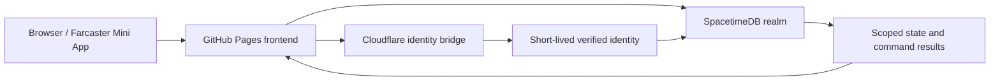

# Warpkeep ecosystem map

This is the default-branch entry map. It explains where the system lives and
routes active work to its source. The detailed
[0.4 source map](https://github.com/ael-dev3/Warpkeep/blob/codex/prepared-keep-bindings-fix/docs/agent-notes/0.4.0/repo-map.md)
and [architecture](https://github.com/ael-dev3/Warpkeep/blob/codex/prepared-keep-bindings-fix/docs/technical-architecture.md)
are maintained with the development implementation.

## Branches, realms and evidence

| Boundary | Meaning |
| --- | --- |
| `main` | G001 Alpha baseline and release preparation. Existing G002 import scaffolding is not the new playable 0.4 implementation. |
| `codex/prepared-keep-bindings-fix` | Active 0.4 gameplay, PTR, keep presentation and local release/recovery integration. Read the instructions in this checkout. |
| Genesis 001 | Preserve established players, progress and normal timers while freezing new admissions. Source flags alone do not establish the current live state. |
| Genesis 002 | A separate successor realm prepared for a sealed launch. Its player path remains closed; admissions are undecided. |
| Owner PTR | A separate authenticated realm for the new playable journey. Do not infer access from an administrator session or a local fixture. |
| Production | The actual deployed frontend, bridge and database identities. Neither a branch name nor a green test proves their current behavior. |

Use the [0.4 handoff](https://github.com/ael-dev3/Warpkeep/blob/codex/prepared-keep-bindings-fix/docs/agent-notes/0.4.0/README.md)
for dated status and the [roadmap](../design/roadmap.md) for priorities.

## Runtime ownership

The browser owns presentation. The bridge verifies identity and session continuity.
SpacetimeDB rechecks the caller and owns admission, ownership, resources, routes,
time and command outcomes. Authentication alone does not grant realm admission.

| Work | Local default-branch entry | Active 0.4 entry |
| --- | --- | --- |
| App composition | [App](../../src/App.tsx), [experience](../../src/components/WarpkeepExperience.tsx) | [App](https://github.com/ael-dev3/Warpkeep/blob/codex/prepared-keep-bindings-fix/src/App.tsx), including separate PTR composition |
| Player identity | [Auth bridge](../../services/auth-bridge/README.md), [Farcaster integration](../farcaster-integration.md) | [Bridge source](https://github.com/ael-dev3/Warpkeep/tree/codex/prepared-keep-bindings-fix/services/auth-bridge/src) and [PTR client](https://github.com/ael-dev3/Warpkeep/tree/codex/prepared-keep-bindings-fix/src/ptr) |
| G001 state and authority | [Browser provider](../../src/spacetime/WarpkeepSpacetimeProvider.tsx), [module](../../spacetimedb/src/index.ts), [access policy](../../spacetimedb/src/genesis001AccessPolicy.ts) | Preserved G001 paths; not the new gameplay core |
| G001 gathering | [Worker authority](../../spacetimedb/src/castleWorkerAuthority.ts), [Worker reducers](../../spacetimedb/src/reducers/castleWorkers.ts) | Separate [gameplay04 core](https://github.com/ael-dev3/Warpkeep/tree/codex/prepared-keep-bindings-fix/spacetimedb/gameplay04) and [PTR transaction adapters](https://github.com/ael-dev3/Warpkeep/tree/codex/prepared-keep-bindings-fix/spacetimedb/ptr/src) |
| World and keep rendering | [G001 scene](../../src/components/realm/createRealmScene.ts), [legacy Inner Keep specification](../design/inner-keep-construction.md) | [Greater Realm runtime](https://github.com/ael-dev3/Warpkeep/blob/codex/prepared-keep-bindings-fix/src/greater-realm/createGreaterRealmSceneRuntime.ts), [keep04](https://github.com/ael-dev3/Warpkeep/tree/codex/prepared-keep-bindings-fix/src/components/keep04) |
| G002 and private atlas | [G002 module](../../spacetimedb/genesis002/src/index.ts), [atlas tools](../../scripts/atlas), [private generation boundary](../security/greater-realm-private-generation.md) | [G002 source](https://github.com/ael-dev3/Warpkeep/tree/codex/prepared-keep-bindings-fix/spacetimedb/genesis002/src) remains separate from playable PTR adapters |
| Generated bindings | [Binding generator](../../scripts/generate-spacetime-bindings.mjs), [browser bindings](../../src/spacetime/module_bindings) | [Development source map](https://github.com/ael-dev3/Warpkeep/blob/codex/prepared-keep-bindings-fix/docs/agent-notes/0.4.0/repo-map.md) identifies each realm's generator and consumer |
| Delivery and recovery | [Workflows](../../.github/workflows), [source classifier](../../scripts/verify-0.4.0-sealed-launch.mjs), [historical recovery guides](../operations/reconstruction/README.md) | [Release/recovery service](https://github.com/ael-dev3/Warpkeep/tree/codex/prepared-keep-bindings-fix/services/release-recovery), [local release tools](https://github.com/ael-dev3/Warpkeep/tree/codex/prepared-keep-bindings-fix/scripts) and [integration status](https://github.com/ael-dev3/Warpkeep/blob/codex/prepared-keep-bindings-fix/docs/agent-notes/0.4.0/release-and-infrastructure.md) |

## Trace a new gameplay change

On the development branch, start at `PtrRealmProvider` and the gameplay controller
in `src/ptr/gameplay04/`. Follow its validated state and command envelope through
generated PTR procedures to the adapters in `spacetimedb/ptr/src/`, then into
`spacetimedb/gameplay04/`. The adapter owns caller and database authorization,
atlas resolution, transactions and persistence; the shared core owns game rules.
The returned authoritative state drives `keep04` and world presentation.

0.4 resources become spendable at authoritative Worker return. Economy buildings
improve matching yield, Barracks shorten travel, and the Cathedral shortens future
construction. These are distinct from G001 gathering and dormant construction
discounts. Current tuning, retry behavior and tests belong with the
[gameplay specification](https://github.com/ael-dev3/Warpkeep/blob/codex/prepared-keep-bindings-fix/docs/superpowers/specs/2026-09-05-warpkeep-0.4-gameplay-design.md)
and source, not a duplicated README policy.

A connected implementation still needs verified owner play, visual coverage,
session continuity and release evidence. Follow the source map's real callers;
do not treat an isolated helper, unavailable production attester or test-only
assembler invocation as a finished operating interface.

## Verification and delivery

Root tests live in [tests](../../tests); the
[SpacetimeDB package](../../spacetimedb/package.json) owns separate module checks,
and the [auth bridge](../../services/auth-bridge/package.json) owns its service
checks. The development branch adds its own recovery-service package. Use each
package's current scripts and [CONTRIBUTING](../../CONTRIBUTING.md).

The [Verify workflow](../../.github/workflows/verify.yml) checks source. The
[Pages workflow](../../.github/workflows/deploy-pages.yml) then classifies an exact
verified main commit and selects a release lane; its preparation path can skip
build and deployment. Cloudflare and SpacetimeDB have separate artifact, identity
and target boundaries. Publishing documentation or a development checkpoint does
not activate a realm.

## Documentation ownership

- [README](../../README.md), [direction](../design/warpkeep-direction.md) and
  [roadmap](../design/roadmap.md) explain the promise and priorities.
- [AGENTS](../../AGENTS.md) and [CONTRIBUTING](../../CONTRIBUTING.md) explain how to work.
- The development architecture and source map explain ownership and navigation.
- Specifications define intended behavior; dated evidence records observed results.
- Operations documents explain the actual operating path and recovery.
- [Asset provenance](../../ASSETS-LICENSE.md) and its source records govern reuse.

Update the owner of a topic and link it from the index. When a branch boundary
changes, update these routes rather than leaving competing versions of current
guidance.
