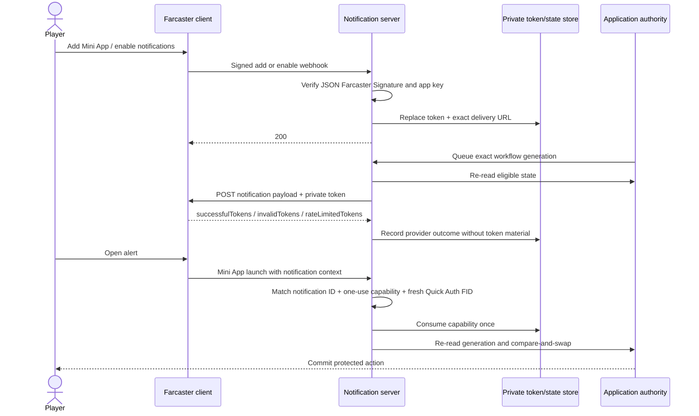

# Reliable Farcaster Mini App notifications

This is the public implementation and operations guide behind Warpkeep's first
confirmed Farcaster Mini App admission alert. The alert was visibly observed by
the owner canary on 4 August 2026. A public-safe operator receipt classified the
legacy admitted generation as `already-sent` after six bounded attempts with no
authority-verification failure. That canary proved the real transport could
work; because it was an already-admitted reconciliation, it did not prove the
required notification-before-admission ordering. The accompanying
notification-first path closes that gap for future admissions.

The useful lesson was simple: a notification is not one API call. It is a small
protocol with separate consent, provider, launch, identity, and
application-authority states.

The design below is intentionally reusable. Warpkeep's game-specific admission
rules are one example of a higher-stakes action that should happen only after
the notification flow has been verified.

## The five states that matter

| State | Evidence | What it proves |
| --- | --- | --- |
| Consent recorded | A valid signed `miniapp_added` or `notifications_enabled` webhook containing notification details | A Farcaster client issued a token for this Mini App, client, and FID |
| Provider accepted | The exact token appears in `successfulTokens` | The notification server accepted the handoff |
| Alert launch observed | `context.location.type === "notification"` and its `notificationId` matches | The host launched the Mini App from that notification context |
| Identity verified | A server-verified Quick Auth JWT has the expected domain and FID | The current authenticated Farcaster identity matches the workflow |
| Application action committed | The app's authority layer accepts a compare-and-swap transition | The protected application state actually changed |

Do not collapse these into one status. In particular, `successfulTokens` does
not prove device delivery, OS display, a human read, or a click. Farcaster's
notification guide documents provider response categories separately from the
later notification launch context.

## The working sequence



Warpkeep does not admit a player merely because the provider accepted a
notification. Provider acceptance creates a one-use, time-bounded grant intent.
The alert opens the Mini App with:

- a unique `notificationId` in Farcaster's immutable notification launch
  context;
- a separate one-use capability in the target URL fragment, removed from the
  visible URL before rendering; and
- a freshly requested Quick Auth token that the server validates for the same
  FID and domain.

Only after all three match does the notification service record a client
acknowledgement. The operator then re-reads the unchanged access-request
generation and uses a compare-and-swap admission reducer. A stale request,
different FID, launcher context, reused ticket, expired intent, or changed
authority state fails closed.

## 1. Publish the exact webhook URL

Notifications require `webhookUrl` in the Mini App manifest served from the
registered production domain:

```json
{
  "miniapp": {
    "version": "1",
    "name": "Example",
    "homeUrl": "https://example.com",
    "webhookUrl": "https://api.example.com/farcaster/webhook"
  }
}
```

The production domain matters. Farcaster documents that `addMiniApp()` works
against the deployed domain matching the manifest, not a development tunnel.

## 2. Treat webhooks as signed state transitions

Handle the four current events:

- `miniapp_added`: store notification details when present; their presence is
  optional;
- `notifications_enabled`: replace the existing token and URL;
- `notifications_disabled`: invalidate and erase the token immediately;
- `miniapp_removed`: invalidate and erase every token for that FID/client pair.

Verify the JSON Farcaster Signature and current app-key authority before using
the FID or notification details. The official `@farcaster/miniapp-node` package
provides `parseWebhookEvent`; its app-key validation callback still needs a
current Farcaster network view. Return `200` only after the relevant state is
durably stored. Clients may retry non-200 webhooks, so make each envelope
idempotent.

Store the token and the exact URL only on the server. A notification token is a
secret permission scoped to the Farcaster client, Mini App, and user FID. Never
put it in browser state, public tables, analytics, query strings, or logs.

Warpkeep additionally verifies app-key state through independent Hub views and
independent Optimism RPC views. That is application hardening, not a Farcaster
requirement. Its delivery pause suppresses sends but deliberately continues to
accept valid enable, disable, add, and remove events so consent state cannot be
lost during a rollout.

## 3. Send the notification

POST the payload to the exact URL supplied with the token:

```json
{
  "notificationId": "access-grant-<unique-intent>",
  "title": "Welcome",
  "body": "Open the app to continue.",
  "targetUrl": "https://example.com/#grant=<one-use-capability>",
  "tokens": ["<private-token>"]
}
```

Current Farcaster limits are:

- `notificationId`: 128 characters;
- title: 32 characters;
- body: 128 characters;
- `targetUrl`: 1,024 characters and the exact registered hostname;
- tokens: at most 100 per request.

The hostname comparison includes subdomains. A mismatch can permanently
invalidate the affected token. Validate the stored destination against a
server-side allowlist before every send; never accept an arbitrary delivery URL
from an operator request or browser.

Use a stable `notificationId` while retrying the same logical alert. Farcaster
combines FID and notification ID as a 24-hour idempotency key. Generate a new ID
only when intentionally issuing a new alert. Warpcast currently documents one
notification per 30 seconds and 100 per day per token; other clients may apply
their own limits.

## 4. Classify the provider response exactly

An HTTP 200 response has three primary token lists:

- `successfulTokens`: record provider acceptance;
- `invalidTokens`: erase those tokens and require a new signed enable event;
- `rateLimitedTokens`: retain consent and retry after backoff.

Validate that the response accounts for the token exactly once. Bound response
size and time, reject redirects, and distinguish transport failures from
application-authority verification failures. An authority outage should not
consume the entire outbound-delivery retry budget.

Warpkeep uses six bounded delivery attempts with backoff and a 24-hour pending
lifetime. Invalid tokens are removed immediately. A provider-accepted but
unopened grant can be deliberately reissued no more than twice for the exact
request generation, after a five-minute quiet period. Reissue rotates the
intent, notification ID, and capability; ordinary status polling never sends a
new alert.

## 5. Verify the launch separately

When a player opens an alert, the host sets:

```ts
sdk.context.location = {
  type: 'notification',
  notification: {
    notificationId,
    title,
    body,
  },
}
```

Compare `notificationId` with server-side intent state. Do not authorize from
`context.user`: Farcaster's context documentation explicitly treats user and
client context as untrusted presentation data.

Authenticate the request independently. Quick Auth returns a signed JWT whose
`sub` is the FID; validate it on the server for the registered domain. For
Warpkeep's admission acknowledgement, a normal browser session cannot replace
Quick Auth, and the client requests a fresh host token for the first attempt.
That is a Warpkeep security policy rather than a platform requirement.

For sensitive workflows, bind the notification ID to an additional one-use
capability and the exact server-side workflow generation. Consume it once,
serialize acknowledgement against reissue, and perform the final authority
mutation with compare-and-swap.

## Token-free diagnostics

Useful diagnostics do not need notification secrets. Warpkeep exposes a
protected operator projection containing only bounded state such as:

- system state: enabled or paused;
- subscription state and active count;
- workflow generation: pending request or admitted epoch;
- delivery state: queued, retrying, accepted, exhausted, or absent;
- grant state: created, provider accepted, or client acknowledged;
- attempt and verification-failure counts;
- coarse failure category and next retry time;
- provider-acceptance and client-acknowledgement timestamps.

Do not log notification tokens, delivery URLs, one-use capabilities,
notification IDs, webhook envelopes, Quick Auth JWTs, provider bodies, profile
data, IP addresses, or administrator credentials. Keep detailed receipts in a
private audit record; public reports should use counts, lifecycle states, code
coordinates, and redacted timestamps only.

### Failure map

| Observation | Likely boundary | Safe response |
| --- | --- | --- |
| No signed enable event | Manifest, add flow, or client consent | Verify production manifest; ask the user to add/enable once |
| `not-subscribed` | No active server-side token | Do not send or admit; wait for a signed enable event |
| Invalid token | Consent changed or token expired | Erase it; never retry until a new enable event |
| Rate limited | Provider quota | Keep consent and back off |
| Domain/target mismatch | Configuration defect | Stop sends; correct the exact registered hostname |
| Provider accepted, alert not observed | Device/client delivery is unproven | Preserve state; use a bounded deliberate reissue, not polling |
| Alert opens as launcher/cast context | Not the intended notification launch | Refuse the protected action and ask the user to reopen the alert |
| Notification ID mismatch | Stale or different alert | Reject and keep authority unchanged |
| Quick Auth FID mismatch | Host account changed or stale identity | Reject, reacquire authentication, and never fall back to a cookie |
| Client acknowledged, authority unchanged | Request generation changed or CAS failed | Re-read application state; do not replay the old capability |

## Canary checklist

1. Validate the production manifest and exact webhook URL.
2. Start with outbound delivery paused.
3. Enable notifications in the real client.
4. Prove the signed enable event was verified and the token stored privately.
5. Disable notifications and prove the token is erased.
6. Re-enable and prove a new signed token state replaces the old one.
7. Queue one synthetic or owner-owned workflow generation.
8. Enable outbound delivery and inspect token-free provider classification.
9. Confirm visible delivery separately; this requires a real client observation.
10. Open the alert and prove matching notification context.
11. Prove server-validated same-FID Quick Auth and one-use consumption.
12. Commit the protected action only after re-reading the exact authority state.
13. Retry the capability and prove replay rejection.
14. Exercise invalid-token, rate-limit, timeout, stale-context, and changed-state
    fixtures locally.
15. Pause delivery again and prove signed opt-out still works.

## Warpkeep source map

- Manifest: [`public/.well-known/farcaster.json`](../public/.well-known/farcaster.json)
- Signed webhook verification: [`services/auth-bridge/src/miniAppWebhook.ts`](../services/auth-bridge/src/miniAppWebhook.ts)
- Private delivery state, retries, grants, and diagnostics: [`services/auth-bridge/src/admissionNotifications.ts`](../services/auth-bridge/src/admissionNotifications.ts)
- Browser host/context projection: [`src/farcaster/miniapp/miniAppRuntime.ts`](../src/farcaster/miniapp/miniAppRuntime.ts)
- Fresh identity-bound acknowledgement: [`src/farcaster/useAdmissionGrantAcknowledgement.ts`](../src/farcaster/useAdmissionGrantAcknowledgement.ts)
- Operator queue, inspection, reissue, and admission sequence: [`scripts/hermes-admin.ts`](../scripts/hermes-admin.ts)
- Request compare-and-swap authority: [`spacetimedb/src/reducers/accessRequests.ts`](../spacetimedb/src/reducers/accessRequests.ts)
- Delivery lifecycle tests: [`services/auth-bridge/test/admissionNotifications.test.ts`](../services/auth-bridge/test/admissionNotifications.test.ts)
- Webhook verification tests: [`services/auth-bridge/test/miniAppWebhook.test.ts`](../services/auth-bridge/test/miniAppWebhook.test.ts)

## Official references

- [Sending Notifications](https://miniapps.farcaster.xyz/docs/guides/notifications)
- [Mini Apps specification](https://miniapps.farcaster.xyz/docs/specification)
- [Notification launch context](https://miniapps.farcaster.xyz/docs/sdk/context)
- [Quick Auth](https://miniapps.farcaster.xyz/docs/sdk/quick-auth)
- [`getToken`](https://miniapps.farcaster.xyz/docs/sdk/quick-auth/get-token)
- [`addMiniApp`](https://miniapps.farcaster.xyz/docs/sdk/actions/add-miniapp)

The public claim is deliberately narrow: Warpkeep stores consent from signed
webhooks, sends a one-use admission link, records provider acceptance, and on
launch binds the matching notification ID and capability to a server-verified
same-FID Quick Auth identity. This proves the admission protocol state. It does
not prove that an operating system displayed—or a person read—the alert.
