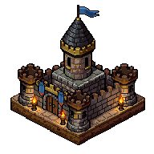
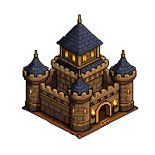
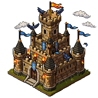
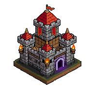
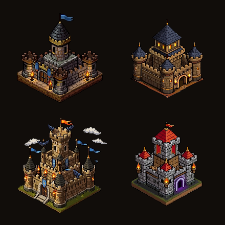

# Warpkeep PixelLab Castle Sprites — 2026-06-21

Four PixelLab-generated castle sprite candidates for future Warpkeep visual direction, plus one contact sheet preview.

These are reference/generated art assets, not final production UI art.

License/status: reserved project reference assets. See `../../../../ASSETS-LICENSE.md`.

## Files

| # | File | Notes | Size | SHA-256 |
|---|---|---|---:|---|
| 01 | `warpkeep-castle-01-starter-keep-blue-banner.png` | Starter keep with blue banner, compact early-game castle sprite | 192×192 | `a800a723d4649d118fa7495b2382bc4b81c81b3b6bca9f1deacfd92375d693db` |
| 02 | `warpkeep-castle-02-fortified-keep-blue-roofs.png` | Fortified blue-roof keep with side turrets and upgraded walls | 192×192 | `a37cb4e6f190acbbbb264180cce719cbd4f1c3a77abdf6b2f74f2518829e8cf9` |
| 03 | `warpkeep-castle-03-signal-watchtower-ravens.png` | Signal/watchtower castle with beacon, ravens, and scouting theme | 192×192 | `61aaf1060f7461f795e06f4f3eae5eff121474445290210bb7d24c9a95a04cf2` |
| 04 | `warpkeep-castle-04-red-war-citadel-warpglow.png` | Red war citadel variant with crimson banner and subtle warp-gate glow | 192×192 | `249f335e81a27237bf4f579aae62041ce76109fc6599ae03a7b1ddc23ef5e34e` |
| 05 | `warpkeep-castle-contact-sheet.png` | Contact sheet preview of the four generated castle sprites | 440×440 | `8f5849658fef40298e76b1b6756785775ed3755828089a78e146272281d75d7b` |

## Preview

  
  
  
  

  

## Generation notes

- Source concept: “Every FID has a castle.”
- Intended mood: Farcaster-native asynchronous fantasy 4X strategy game.
- Shared settings: 192×192, transparent background, low top-down/south-facing, medium detail, black outline.
- Palette direction: dark brown/black, antique gold, blue-banner/blue-roof castles, and one red war citadel variant.
