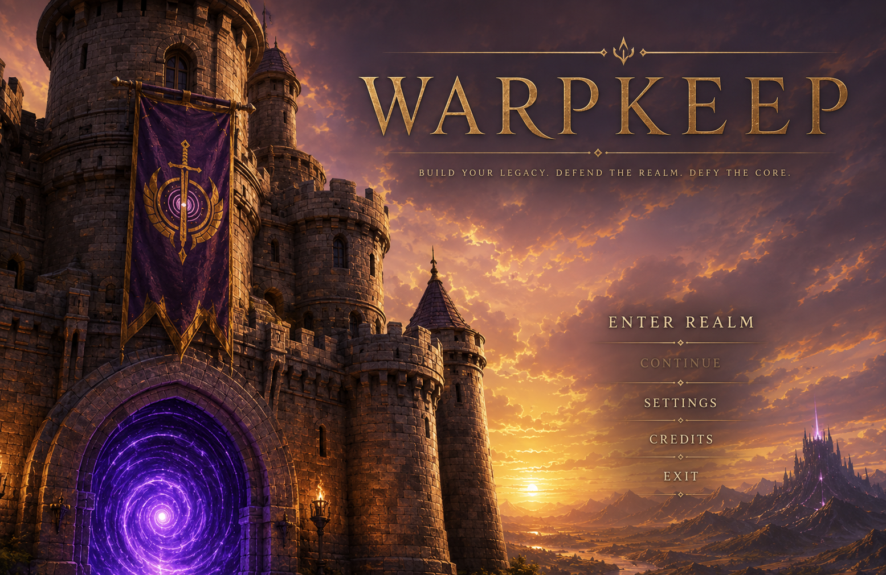

# Hegemony main-menu archive and runtime record — 2026-07-10

This directory preserves the Ael-provided menu-development references byte-for-byte and records the runtime derivatives used by the title-to-Hegemony-menu milestone.

## Archived source media

- [`warpkeep-menu-loop-silent.mp4`](warpkeep-menu-loop-silent.mp4) — 15.041667-second, 1280×720 H.264 High film at 24 fps with no audio stream.
- [`sunset-hegemony.mp3`](sunset-hegemony.mp3) — 401.919979-second stereo 48 kHz MP3 with embedded cover art. The archived attachment arrived with an `.ogg` name, but its detected container and codec are MP3, so the repository filename uses `.mp3` without changing its bytes.
- [`warpkeep-main-menu-reference.png`](warpkeep-main-menu-reference.png) — 1555×1011 composition reference.

The film container supplied with the implementation prompt has a different container-level hash from the archived Discord attachment, but both contain the same H.264 video bitstream and decode to the same pixels. The manifest records both container hashes and the shared stream hash.

## Reference use

The composition reference guides the castle-left/open-right hierarchy, antique-gold title and ornaments, restrained tagline, vertical command stack, warm sunset stone, violet gateway energy, foreground-to-distant-citadel depth, and calm atmospheric motion. Its baked lettering is never served by the application: the production title, tagline, commands, notices, and Return to Title control are live semantic HTML/CSS over the clean film.

## Runtime media decisions

- The original film wrap was 7.62× the median ordinary frame-to-frame change at analysis resolution. The runtime derivative uses a tested one-second tail-to-head dissolve and begins at source 1.000 seconds; across three decoded loops, its boundary is about 67.7% less discontinuous with no frame-cadence drift.
- The runtime film explicitly declares limited-range BT.709 primaries, transfer, and matrix metadata. Its poster is a color-managed first-frame WebP with an embedded sRGB profile, keeping the poster and first decoded video frame visually aligned across the tested Chromium and macOS decode paths.
- The “Sunset Hegemony” MP3 is copied byte-for-byte into `public/audio/`. Its final cadence completes before a quiet release; the audio director starts the standby source at 0.000 seconds when the outgoing source reaches 400.128 seconds and performs a 1.792-second equal-power overlap through 401.920 seconds.
- Files in this archive remain documentation assets. The application loads only the copies and derivatives identified under `public/` in `manifest.json`.

## Provenance

- Source: Ael-provided project attachments.
- Image attachment basename: `img_8be8dd61c97e.png` / `warpkeep-main-menu-reference.png`.
- Video attachment basename: `warpkeep_menu_loop_no_audio.mp4`.
- Audio attachment basename: `audio_ac578c8d7609.ogg` / `Sunset Hegemony.mp3`; detected as MP3.
- Audio metadata: title `Sunset Hegemony`, artist `ael_dev7`, instrumental, made with Suno.
- Licensing: covered by the repository's project-owned media policy in [`../../../../ASSETS-LICENSE.md`](../../../../ASSETS-LICENSE.md).

See [`manifest.json`](manifest.json) for exact archive/runtime filenames, hashes, dimensions, durations, codecs, bytes, transformations, and intended uses.
