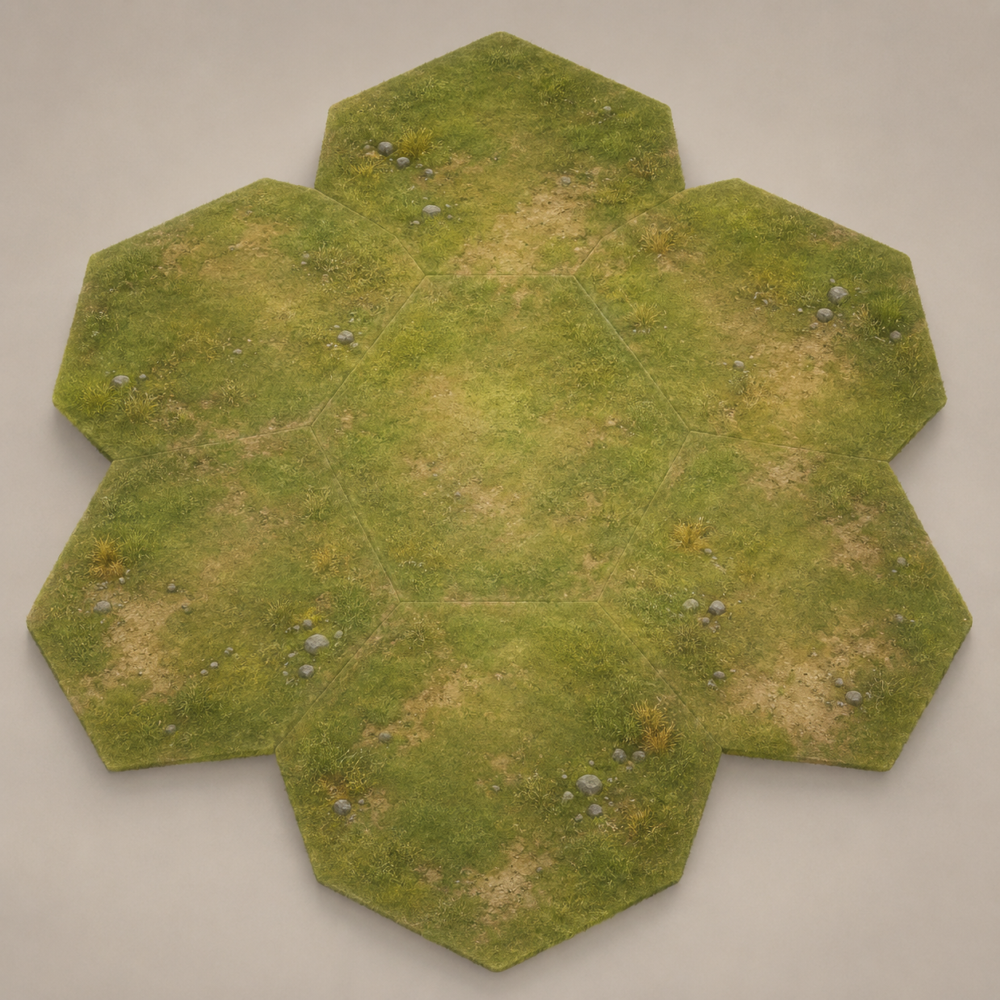

# Hegemony Lowlands Seven-Tile Reference

Ael-supplied terrain/tile reference for the Hegemony Lowlands visual direction.

## Provenance

- **Source:** Discord attachment supplied by Ael
- **Source message:** [`1525464522897227866`](https://discord.com/channels/1483857530282053754/1524505797797744742/1525464522897227866)
- **Original filename:** `ChatGPT_Image_Jul_11_2026_12_52_17_AM.png`
- **Archive filename:** `hegemony-lowlands-seven-tile-reference.png`
- **Archive date:** 2026-07-11
- **Integrity:** SHA-256 `078c963e8c0b2f848bc2faa29f79b5475403d181ac820529fe651949a24cf3f0`; 2,665,702 bytes

## Visual direction

The square image presents seven pointy hex terrain pieces in a flower-like arrangement: one central tile surrounded by six neighbors. It shows muted olive/moss lowland grass, warm tan soil and worn paths, sparse gray stones, small dried-gold grass tufts, and calm natural-detail density.

The source image visibly includes the presentation treatment of the reference: individual tile seams and raised polygon edges, cast shadows, and a neutral beige background. Those traits are documented as reference context only and are not target runtime geometry.

## Usage boundary

This PNG is archived as a **reference asset only**. Warpkeep must not load it as a runtime texture, crop it into tiles, trace its fixed soil/decoration layout, or depend on its seams, board-piece edges, cast shadows, or background. The procedural realm surface should extract only broad palette, material, density, and readability cues.

The original PNG was copied byte-for-byte. No resizing, recompression, color correction, or metadata stripping was applied. See [`../../../../ASSETS-LICENSE.md`](../../../../ASSETS-LICENSE.md).
