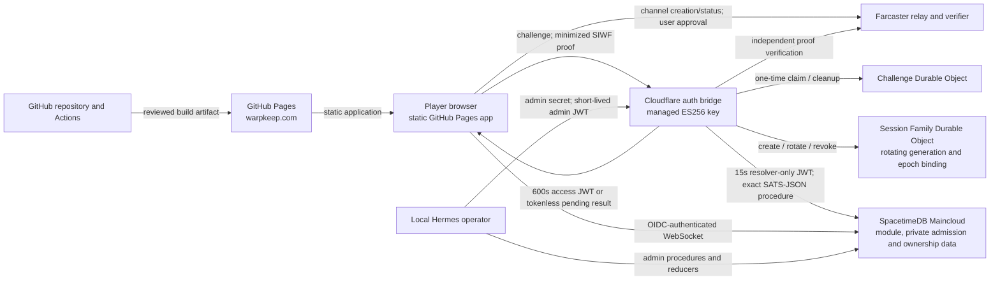

# Warpkeep threat model — historical baseline and active Alpha 0.3.2 boundary

Status: the Alpha 0.2 and Alpha 0.3.1 evidence remains historical. Alpha 0.3.2
is live on backend protocol 3 at its separately recorded production
coordinates: the deterministic 1,261-cell Genesis world and 100 close-outward
slots are seeded, deliberately admitted founders hold permanent castles, and
Worker auth plus shared-alpha realm entry are enabled. Exact founder counts and
identities remain private. This is not an OWASP ASVS certification or a
penetration-test attestation.

## Scope and revision

This model covers the browser experience, Farcaster Sign In with Farcaster
(SIWF), the Cloudflare authentication bridge, SpacetimeDB authorization, local
Hermes administration, and the GitHub Pages delivery path.

- Runtime audit base: `2e9f3cfe9eb3f04c37156fb6cf2b82377ad616cc`
- Runtime branch: `feat/spacetimedb-basic-connection` (PR #11)
- Licensing-policy review: `f57d252e56d6d3abf1530d12997815c5b1466e35`
  (PR #15), reviewed separately from the runtime branch
- Intended public frontend: `https://warpkeep.com/`
- Intended OIDC issuer: `https://auth.warpkeep.com`
- Intended database service: SpacetimeDB Maincloud

The model assumes a deliberately small, invite-only alpha. Protocol v2 replaces
the historical browser-readable 30-day bearer with a 600-second memory-only
access token and a separate maximum-30-day HttpOnly rotating session family.
The production checkpoint is evidence only for its recorded exact source,
deployment, configuration, aggregate, and owner-canary coordinates. It does not
make an arbitrary checkout or later deployment trusted, and every future
activation must repeat the fail-closed gates.

## Deployed Alpha 0.3.2 status and continuing authority boundary

The deployed protocol-3 target retains exact `auth_version: 2`, positive auth
epochs, tokenless pending sessions, a `__Host-` session cookie, server-side
family rotation/revocation, a dedicated resolver principal/procedure, backend
protocol 3, and retired public v1 challenge/exchange routes. The bridge persists
and issues only the verified FID. SpacetimeDB freezes the deployed public
`player` table as an inert legacy contract and appends identity-free public
`player_v2` plus private
`player_ownership_v2`. Worker `PUBLIC_AUTH_ENABLED` and frontend
`VITE_WARPKEEP_SHARED_ALPHA_ENABLED` are true only at the recorded enabled
Alpha 0.3.2 production coordinates; the checked-in Worker default remains
false so a normal redeploy fails closed.

The repository includes a pinned SpacetimeDB 2.6.1 loopback rehearsal proving
the five legacy tables remain unchanged while the v2 pair and 12 protocol-3
tables are appended, empty and synthetic nonempty fixtures retain their data, a
second publication is idempotent, partial state is detected, and guarded
rollback is refused before schema change. That command is local repository
evidence only. The separately approved guarded publication and post-publish
probes attest the recorded Maincloud checkpoint; neither substitutes for the
other.

The historical Alpha 0.3.1 rollout completed the guarded protocol-v2 Maincloud
publication, additive Durable Object migration, independent managed
cookie-secret setup, paused Worker/frontend verification, ordered enablement,
and one owner canary without changing admission or world data. Alpha 0.3.2 later
completed the additive protocol-3 publication, deterministic seed, deliberate
founding actions, and enabled shared-realm verification. Historical Alpha 0.2
or Alpha 0.3.1 evidence is not proof of the current protocol-3 coordinates.

## System and data flow

The browser may request identity proof, but it does not choose the authoritative
FID. The bridge independently verifies the proof and obtains the current
authorization epoch from a fixed server-to-server procedure before issuing a
player token. SpacetimeDB remains authoritative for admission, player/castle
creation, and world state. Anonymous visitors do not open a database connection.

## Assets

| Asset | Required protection |
| --- | --- |
| Farcaster FID identity binding | Integrity; a client-supplied FID must never become authority. |
| SIWF message and signature | Confidentiality in transit and logs; strict contextual validation; single use. |
| Relay channel token, channel URL, nonce, and request ID | Confidentiality, bounded lifetime, and no persistence beyond the active flow. |
| Player OIDC access JWT | JavaScript-memory-only confidentiality; exact auth version/claims; 600-second maximum; positive epoch enforcement. |
| Session-family cookie and Durable Object state | `__Host-`, Secure, HttpOnly, SameSite=Strict; integrity-protected rotating reference; server-side expiry/revocation. |
| Tab-scoped Farcaster presentation cache | Sanitized public FID, username, display name, and HTTPS avatar only; written after fresh-signature and same-FID bridge validation; exact-FID display merge only after successful refresh; bounded expiry and purge; never authority. |
| Browser logout-intent tombstone | Non-secret, base-path scoped marker/timestamp only; no FID, proof, token, cookie, family ID, or profile data; 30-day maximum and explicit Terms-gated activation clearing. |
| Alpha Terms gate state | Unchecked by default, component-memory only, one entry attempt, no identity or cross-tab/persistent representation. |
| Versioned Alpha Terms acceptance evidence | Private immutable FID/version/time row only after authenticated player acceptance; never a public projection and never contains proof, QR, token, cookie, signature, or wallet data. |
| Worker-to-SpacetimeDB resolver JWT | Server-only, Worker-minted 15 seconds, module rejection ceiling 60 seconds, exact resolver subject/sole role and one-FID binding, fixed Worker destination, never logged. |
| ES256 private signing key | Worker-managed secret only; absent from source, browser, artifacts, and logs. |
| Hermes admin secret | Operator/Worker secret only; never placed in browser code, process output, or repository. |
| Session-cookie HMAC key | Independent Worker-managed secret; never reused with signing/admin material or recorded in recovery evidence. |
| Farcaster/Optimism RPC credential | Worker secret only; URL and credential must not be logged or returned. |
| Cloudflare account and Worker | Deployment and configuration integrity; least privilege. |
| SpacetimeDB identity and claims | Exact issuer, audience, token type, subject, role, FID, epoch, and time validation. |
| Private whitelist, player-ownership binding, and admin audit data | Server-only confidentiality and authorized mutation; opaque OIDC identity must not enter public subscriptions. |
| Persistent player, castle, and world state | Transactional integrity and module-authoritative ownership. |
| Minimum browser identity state | No bearer/family secret persistence; strict parsing, expiry, logout propagation, and minimum data. |
| GitHub deployment authority | Least privilege, immutable workflow dependencies, reviewed artifact provenance. |
| Pages custom domain | HTTPS integrity, canonical redirects, and controlled deployment. |
| Local operations machine | Separation from public repository content and protection of operator credentials. |

## Trust boundaries

1. **Browser ↔ Farcaster relay/client.** Channel creation and approval data are
   untrusted until independently verified. A relay response is not itself an
   identity assertion.
2. **Browser ↔ auth bridge.** All request fields, headers, origins, and proof
   data are hostile input. The exchange accepts exactly `identity: { fid }` and
   rejects profile metadata. TLS, exact CORS policy, strict size bounds,
   contextual proof checks, and replay protection apply.
3. **Worker ↔ Farcaster verifier / Optimism RPC.** The endpoint and credential
   are server configuration. Responses may fail, stall, or be malformed and
   must not produce a token on error.
4. **Worker ↔ SpacetimeDB HTTP procedure.** A resolver-only ephemeral token
   crosses this boundary. Its exact subject/role, signed one-FID binding,
   15-second Worker lifetime, HTTPS origin, database, procedure, redirects,
   time, body size, content type, and exact `[state, authEpoch]` SATS-JSON
   response shape are constrained. The module retains a 60-second rejection
   ceiling and rejects a `resolver_fid`/argument mismatch before lookup.
5. **Browser ↔ SpacetimeDB Maincloud.** The browser presents a bearer token.
   Only a current admitted player receives a browser token; every sensitive
   procedure/reducer repeats module-side authorization. Frontend gating is not
   a security boundary.
6. **Hermes ↔ Worker admin endpoint.** Browser origins are rejected. The
   long-lived admin secret may be sent only to the canonical bridge, which
   returns a short-lived, narrowly shaped admin JWT.
7. **Hermes ↔ SpacetimeDB admin surfaces.** The short-lived token may be sent
   only to the canonical Maincloud origin/database. Admin role and subject are
   distinct from player authority.
8. **GitHub Actions ↔ Pages.** Dependency-running build jobs are untrusted with
   deployment authority. Only the deploy job receives Pages and OIDC write
   permissions, and it consumes the built artifact.
9. **Public repository ↔ local operations machine.** Repository scripts and
   documentation are public and must contain no credential material. Local
   secret stores and private reports remain outside the repository.

## Attacker classes

- anonymous browser user;
- valid but non-whitelisted Farcaster user;
- malicious whitelisted player;
- bearer-token holder after XSS, extension, memory capture, or device compromise;
- XSS or malicious-extension attacker operating in the application origin;
- replay and parallel-request attacker;
- origin-spoofing non-browser client;
- availability, quota, and cost attacker;
- compromised package, package registry path, or downloaded tool;
- malicious pull-request contributor or compromised GitHub Action;
- on-path network attacker before transport policy is established;
- misconfigured or compromised operator environment.

## Security properties and controls

### Identity and proof

- A decimal FID is derived from the independently verified Farcaster proof, not
  a browser display field or reducer argument.
- SIWF context is bound to the configured domain, URI, nonce, request ID, and
  expiration before a token can be issued.
- The proof FID, requested FID, and exact FID-only exchange identity must agree.
- The bridge rejects username, display-name, avatar, and other optional profile
  fields; it stores only the verified FID in a session family and issues no
  optional profile claims in an access JWT.
- The module independently ignores optional profile-shaped JWT claims during
  bootstrap and inserts undefined public profile fields. JWT authority cannot be
  repurposed as a profile-write channel.
- Proof material, relay secrets, tokens, credentialed URLs, and private
  responses are excluded from logs and public error messages.

### Replay and resource control

- Challenges are random, expire, and are atomically claimed before expensive
  verification, database lookup, or signing. The QR/deep-link SIWF challenge
  has an exact five-minute absolute lifetime.
- A successful or definitively invalid exchange consumes the challenge. Only
  an explicitly retryable verifier outage, epoch lookup failure, or signing
  failure restores a still-live challenge.
- Durable Object storage is alarm-cleaned and deallocated after use or expiry.
- Request and response bodies are streamed through byte bounds with strict text
  decoding. The browser bridge exchange, Worker epoch lookup, and local Hermes
  connection/operation paths use explicit deadlines.
- Credential-bearing routes use Durable Object-backed exact rolling-window
  limits: challenge 12/300 seconds, exchange 20/300 seconds, refresh 30/300
  seconds, and the shared admin action 6/300 seconds. Durable
  IPv4-address/IPv6-`/64` buckets use bounded backoff,
  failure-atomic alarm updates, and full expired-object deallocation. Aggregate
  edge monitoring and alert maturity remain necessary before wider availability.

### Tokens and authorization

- Player, resolver, and admin tokens use ES256 and distinct exact principal
  shapes. Players require `auth_version: 2`, positive `auth_epoch`, and empty
  roles. The resolver requires exact `service:auth-epoch-resolver` and sole
  `warpkeep-auth-epoch-resolver`, plus signed `resolver_fid` equal to its one
  procedure argument; Hermes remains exact and admin-only.
- SpacetimeDB verifies the token signature and standard time claims when the
  connection is authenticated. The module then validates issuer, audience,
  token type, auth version, subject, roles, FID, positive epoch, and time
  window. A player cannot use an admin/resolver surface; resolver/admin tokens
  cannot bootstrap or subscribe as players. Because `clientConnected` also runs
  before HTTP procedures, an exact resolver presented while fresh can establish
  a WebSocket and public-table subscriptions that may persist until transport
  disconnect. It can call static `get_alpha_backend_info` only while fresh;
  protected calls recheck expiry and private/player-mutation/admin guards still
  reject it.
- Signed `session_iat`/`session_exp` claims preserve the original player-session
  window across SpacetimeDB's temporary connection-token exchange. Every player
  module call rechecks the maximum-600-second deadline against module time.
- Admin reducer/procedure entry points recheck the connection JWT expiry
  against authoritative reducer time, even when a WebSocket outlives token
  expiry.
- Player admission and the authorization epoch are module-authoritative.
  Denied admission creates no player or castle state.
- First admission starts at epoch one. Epoch zero is only the structured
  missing/disabled sentinel and is never player authority.
- `auth_resolver_get_fid_admission_v2` returns exact missing/disabled/enabled
  state; non-enabled results use epoch zero and enabled requires a positive
  epoch. `admin_get_fid_auth_epoch` is rollback compatibility only.
- Private whitelist, `player_ownership_v2`, and admin-audit tables have no public
  generated query/subscription accessors. Inert generated schema types expose no
  rows. The active public `player_v2` projection contains FID and
  presentation/game fields but no opaque SpacetimeDB OIDC Identity.
- The frozen legacy public `player` table remains schema-compatible, including
  its Identity column, but protocol-v2 code never reads, writes, or subscribes to
  it. Arbitrary old clients can technically request that public table, so a fresh
  pre-publication count other than exactly zero is a hard stop and continuing
  zero-row verification is a privacy requirement.
- Existing-player authorization requires a consistent public `player_v2` row
  and matching private `player_ownership_v2` row. Public-only, ownership-only, or
  mismatched state fails closed.

### Browser session lifecycle

- **ENTER REALM** opens an accessible Alpha Terms gate before any anonymous
  cookie refresh, SIWF challenge, QR/deep link, or database connection. Its
  checkbox is local to the mounted dialog and is destroyed on cancel, close,
  Escape, browser Back, unmount, failure, expiry, retry replacement, or
  completion. Direct `#realm` navigation normalizes to the menu and conveys no
  acceptance or authorization intent. The concise notice links to standalone
  Alpha Terms and a Privacy Notice; neither the gate nor those project-authored
  documents substitutes for formal legal/privacy review.
- After an admitted player authenticates and submits the exact current version,
  SpacetimeDB records private immutable FID/version/time evidence before opening
  the realm subscription. Cancelling an in-flight acknowledgement prevents its
  completion from activating a subscription; it does not attempt to erase an
  already-committed audit row.
- An access bearer exists only in JavaScript memory and expires within 600
  seconds. It is never persisted to localStorage, IndexedDB, a URL, or a
  browser-readable cookie.
- Continuity uses a separate maximum-30-day server-side session family referenced
  by `__Host-warpkeep_session; Secure; HttpOnly; SameSite=Strict; Path=/`.
- Remember-device persistence defaults false. Only explicit opt-in adds a
  persistent cookie lifetime; the default uses a session cookie while the
  server-side family remains absolutely bounded at 30 days.
- Pending admission returns FID-only identity and the HttpOnly reference but no
  access token, so it cannot open a database connection.
- Every authorized refresh rechecks admission and rotates the generation. A
  bound epoch mismatch/missing/disabled result, origin/expiry failure, or stale
  replay revokes the family. Only the immediately previous generation has a
  bounded lost-response recovery grace.
- Successful logout confirms family revocation, expires the cookie, clears
  transient bearer/pending state, and closes the database connection. If durable
  revocation cannot be confirmed, the bridge returns generic `503` and still
  expires the current browser cookie; a separately copied cookie may remain
  usable after storage recovery until the bounded family expires.
- Sign-out writes a non-secret 30-day logout-intent tombstone before the
  best-effort server call. Anonymous startup, focus, visibility, pageshow, and
  direct refresh remain dormant even without a tombstone. Reloads and
  same-origin tabs honor an active tombstone; only a new explicit, Terms-gated
  auth activation clears it before expiry. Malformed or unavailable storage
  blocks refresh.
- The bridge returns only the verified FID. Proof, profile, custody,
  verification, and authentication-method details do not enter session-family
  storage or access-token claims.
- After a fresh signature and matching bridge exchange, `sessionStorage` may
  retain only sanitized public FID/username/display-name/HTTPS-avatar
  presentation. It is read only after a successful bridge refresh and merged
  only for the exact refreshed FID; it cannot authorize or restore a session.
  Its expiry is no later than the server family or 30 days, and tab close
  normally clears it. The next validated refresh purges corruption, expiry, or
  mismatch; sign-out and cross-tab logout clear it immediately. Storage denial
  degrades to FID-only presentation. It never
  contains proofs, tokens, JWTs, cookies, custody/verification addresses, or
  verification data.
- XSS can still copy the in-memory access token, but not the HttpOnly family
  reference; a copied access token remains bounded by 600 seconds and module
  epoch/admission checks.

### Operations and delivery

- Hermes credential-bearing operations allowlist the canonical bridge,
  Maincloud origin, and database. Custom destinations are limited to secret-free
  dry runs.
- A server-only configuration attestation hashes the reviewed v2 issuer,
  origins, SIWF coordinates, gameplay key/database coordinates, dedicated QA
  observer URI/database/audience coordinates and gate, access/resolver/
  challenge/family lifetimes (including the exact five-minute challenge),
  resolver timeout, cookie attributes, and public-auth state without returning
  a secret.
- Production frontend activation and Pages validation require exact
  `https://auth.warpkeep.com` bridge/issuer, `warpkeep-spacetimedb` audience,
  `https://maincloud.spacetimedb.com` service, and `warpkeep-89e4u` database.
  The Worker pins both production resolver origins to that Maincloud origin and
  pins the gameplay database to that database. A production QA tuple additionally
  requires a distinct, independently reviewed database and audience; only
  explicit development profiles may use alternate origins.
- Admin requests reject redirects and use connection, operation, and child
  process deadlines with cleanup.
- Workflow actions are pinned to reviewed immutable commits, and repository
  policy requires SHA pinning. Checkout credentials are not persisted,
  downloaded SpacetimeDB binaries are pinned by release checksum, and all
  package boundaries are audited.
- Build jobs have read-only repository access. Pages and OIDC write authority is
  isolated to the deployment job.
- Verified `main` protection requires pull requests even for administrators,
  strict current-head checks (`verify`, `auth-bridge`, `spacetimedb-module`,
  `analyze`, and `CodeQL`), stale-review dismissal, resolved conversations, and
  linear history; force pushes and branch deletion are disabled.
- The frontend shared-alpha switch defaults off so an incomplete identity chain
  fails closed.
- Worker public auth also defaults false. Module publish, session-family Durable
  Object migration, secret configuration, Worker deploy, frontend deploy, and
  each auth enable are separate approval boundaries.

## Principal threat scenarios

| Threat | Primary control | Residual treatment |
| --- | --- | --- |
| Client chooses or substitutes another FID | Independent SIWF verification and exact FID agreement | Treat verifier/RPC compromise as an external dependency incident. |
| Tampered or stale browser presentation cache | Cache is non-authoritative, read only after successful refresh, exact-FID matched, sanitized, expiry-bounded, and purged on mismatch/logout | Same-FID public presentation can be stale until the next fresh sign-in; storage denial intentionally shows only the FID. |
| Terms gate bypass or replay | Dormant anonymous refresh; direct-route normalization; local unchecked state; disabled continuation; one-shot callback; focus trap; no persistence or identity tracking | The linked project-authored Alpha Terms and Privacy Notice still require formal legal/privacy review; revisit the gate and documents before changing auth entry points. |
| Proof replay or parallel exchange | Expiring Durable Object challenge, atomic pre-work claim, and distributed per-client rolling-window limits | Add aggregate edge monitoring/alerts for broad distributed abuse; tune policy only through separate review. |
| Stolen in-memory access bearer | Exact v2 claims, 600-second maximum, positive epoch/admission checks, disconnect/logout handling | XSS/extension memory capture remains possible for the token's short remaining lifetime; the HttpOnly family is not exposed. |
| Stolen resolver bearer presented before expiry | Server-only minting, exact sole-role and one-FID claims, 15-second Worker initiation window, fixed Worker destination, independent resolver guard | It reveals its bound FID and can resolve only that FID's admission projection while fresh; it can establish public subscriptions that persist until disconnect, but cannot query another FID, read private tables, mutate as a player, or pass Hermes/admin guards. |
| Stolen or replayed session reference | HMAC-authenticated `__Host-` cookie, SameSite=Strict, origin binding, generation rotation, stale-replay family revocation | Endpoint/host compromise remains an incident; bounded previous-generation recovery must remain narrow. |
| Admin credential exfiltration through operator target override | Canonical destination allowlist and secret-free custom dry run | Operator host compromise remains out of application scope. |
| Admin WebSocket remains privileged after JWT expiry | Reducer/procedure-side expiry check using authoritative time | Ensure every future admin entry point calls the common guard. |
| Whitelist bypass or private-row disclosure | Module-side admission and v2 private ownership checks on every protected operation; private tables/bindings; exact-zero legacy-player publication gate | Public world/player-v2/castle projections remain intentionally observable. Arbitrary old clients can request the frozen public legacy player table, so it must remain empty; any nonzero preflight count blocks publication. |
| Browser supplies a spoofed profile or wallet link | Profile and wallet snapshots are accepted only through exact fresh Hermes authority, re-sanitized by the module, and separated into public presentation versus private attribution tables | Trusted Farcaster data can still be stale or incorrect; refresh and correction remain operator responsibilities. |
| Ambiguous or forged burn credit | Two-provider `eth_chainId` and finalized-block agreement, exact raw-log agreement (including the opaque indexed word), reconciled upgrade history, per-event-block implementation/code/hash attestation, atomic wallet snapshot generations, unique indexed event/burn references, and a two-phase batch that advances its cursor only after exact receipt reconciliation | RPC/provider compromise, a contract upgrade, reorg evidence, attribution ambiguity, or a mismatched frozen total stops crediting and requires review; the module cannot independently query Ethereum, and recovery from an incorrectly planned pending batch remains a reviewed operator action. |
| Wallet or burn receipt leaks into the browser | Private attribution, snapshot, receipt, batch, cursor, claim, Terms-acceptance, and authoritative Mark tables have no public subscription path; admin reconciliation returns counts only and public profiles contain aggregate values only | Public Ethereum events and public Farcaster wallet links remain observable at their original sources. Linking them to a FID inside Warpkeep creates private operator data that needs retention/deletion review. |
| External Farcaster avatar tracks a player view | HTTPS-only sanitized avatar URLs and a no-referrer image request policy | The external image host still receives ordinary connection data such as IP address and timing. |
| Game Marks are mistaken for money or a promised reward | Game-only, non-transferable, non-redeemable/no-cash-value product copy; no wallet connection, approval, payment, custody, or browser scanning | Project-authored Alpha copy is not legal advice; formal legal/privacy review remains required before widening use. |
| Logout revocation-store failure | Generic `503`, current-cookie expiry, static failure event, and non-secret 30-day browser tombstone that blocks all refresh until explicit Terms-gated activation | A denied tombstone write plus failed server revocation can leave a later storage-enabled context able to resume a copied cookie until family expiry; investigate without logging identifiers or cookie material. |
| Worker memory/cost exhaustion | Streaming bounds, timeouts, early challenge claim, per-client rate control, and storage cleanup | Aggregate account quotas, telemetry, and alerting remain operational requirements. |
| Malicious dependency or workflow step obtains deployment authority | Lockfiles, audits, required action SHA pins, checksum verification, job privilege split, and protected `main` required checks | Commit signatures remain disabled; security-update remediation needs a private workflow while automated security PRs are intentionally off. |
| First-visit transport downgrade or framing/content-type hardening gap | HTTPS redirect and browser-origin validation | HSTS and response headers depend on the hosting layer and remain an activation check. |
| Misconfigured partial activation | Worker and frontend default-off switches, exact config attestation, and ordered approval gates | Follow the activation runbook; no stage implies approval for publish, migration, secret change, deploy, or enable at another stage. |

## Accepted alpha risks and future requirements

- An origin-level script, malicious extension, or compromised device can copy
  the current memory-only access token. Its authority is capped at 600 seconds
  and the current epoch; browser logout cannot recall a copy already exfiltrated.
- The HttpOnly family reduces bearer persistence exposure but does not make a
  compromised origin/device safe. Rotation, SameSite=Strict, exact CORS/origin,
  server revocation, incident response, and key rotation remain necessary.
- The non-secret logout tombstone suppresses cookie resurrection for its 30-day
  lifetime and is cleared early only by explicit Terms-gated auth activation. Browser storage denial
  remains a residual when server revocation also fails: a future context where
  storage works cannot discover a tombstone that was never written.
- Public game projections are observable to admitted authenticated clients by
  design. The live protocol-3 release adds trusted public Farcaster presentation
  and, only after intentional entry, aggregate SNAP-burn and Mark figures.
  Wallet associations, individual burn receipts, private claims, and
  authoritative balances remain private. Privacy classification and retention
  must be revisited as state expands. Missing and disabled users receive no
  access token and cannot connect.
- The resolver lifecycle exception is required by SpacetimeDB's HTTP procedure
  execution order. A stolen production resolver token presented within its
  15-second lifetime can establish public subscriptions that may persist until
  transport disconnect, read static backend metadata, and resolve only its
  signed FID's admission projection while fresh. It reveals that bound FID but
  cannot query another FID and has no broader private, player-mutation, or
  administrator authority; protected calls independently recheck expiry.
- Existing enabled epoch-zero rows, if any, fail closed under v2 and require
  explicit read-only inspection plus an approved migration decision. They must
  never be silently promoted.
- The bridge now rejects caller-supplied profile metadata and neither persists
  it nor issues it in player JWTs. Public SpacetimeDB presentation columns remain
  a separate, non-authoritative data class and must not contain opaque ownership
  identity.
- Static Pages responses currently lack several defense-in-depth headers,
  including HSTS. Hosting-layer header support or a fronting service is a future
  production requirement.
- A strict main-app CSP cannot yet remove dynamic evaluation: the pinned
  SpacetimeDB browser SDK constructs generated serializers with `Function(...)`.
  Roll out CSP through header-level report-only telemetry and real auth/realm
  browser QA before enforcement; meta CSP cannot provide `frame-ancestors`,
  reporting, or a safe local-development policy.
- Distributed Worker rate limiting is active. Alerting, key-rotation drills,
  incident response, and operational history are not yet mature enough for
  production assurance.
- The deployed protocol-3 backend is production state only at the recorded exact
  source, deployment, schema, aggregate, and probe coordinates. The reviewed
  design preserves the five-table prefix, freezes legacy `player`, appends
  `player_v2` plus `player_ownership_v2`, and then appends 12 protocol-3 tables.
  For every future republish, the local pinned-CLI proof does not replace fresh
  read-only production inspection or explicit approval. A nonzero legacy-player
  count, an orphan or inconsistent graph, or any mismatch from the separately
  reviewed current founded aggregate blocks that operation. Valid admitted and
  player state must never be mistaken for the historical zero-admission
  checkpoint. No delete, break-client, database-recreation, or schema-rollback
  path is authorized.
- GitHub `main` protection is active with pull-request enforcement including
  administrators, strict required checks, stale-review dismissal, conversation
  resolution, linear history, and no force-push/delete. Required commit
  signatures remain disabled. Dependabot security updates remain intentionally
  disabled because automated PRs in a public repository could disclose an
  unpatched vulnerability; private triage and disclosure-safe remediation remain
  operational requirements.

## Assumptions and operational dependencies

- Cloudflare keeps the signing key, RPC credential, admin secret, and independent
  session-cookie key in managed secret storage and never exposes them to Pages
  or untrusted pull requests.
- Production browser/Pages and Worker resolver configuration remain pinned to the
  reviewed Warpkeep auth, audience, Maincloud, and database coordinates;
  development configurability is never accepted as a production profile.
- Farcaster's official verifier correctly binds the signature to the FID.
- SpacetimeDB Maincloud and version 2.6.1 enforce the documented JWT signature
  verification and transaction semantics.
- Every rollout begins staged and fail-closed: `PUBLIC_AUTH_ENABLED=false` and
  `VITE_WARPKEEP_SHARED_ALPHA_ENABLED=false` while the separately approved
  additive module is inspected and verified, the session-family Durable Object
  is migrated, secrets are configured, and Worker/frontend heads are
  independently deployed and attested. Every publication requires exactly zero
  legacy players and zero orphan/inconsistency counters; expected valid founder,
  castle, admission, and v2 pair counts come from a fresh privacy-safe aggregate,
  not the historical empty checkpoint. Containment leaves additive tables inert
  and uses a forward fix rather than destructive rollback. The current Alpha
  0.3.2 coordinates progressed through separately recorded gates to an enabled
  shared realm; that state is not reusable authorization for a future deploy.
- Public v1 challenge/exchange routes remain retired after Worker cutover; the
  legacy admin raw-epoch procedure exists only for rollback compatibility and
  is never an implicit v2 fallback.
- Verified GitHub branch protection and SHA-pinning policy constrain changes to
  `main`; the `github-pages` environment policy must still be recorded and
  rechecked at each release coordinate rather than inferred from branch rules.
- Operators do not pass secrets on command lines, store returned JWTs, or run
  destructive publish/database commands outside the reviewed runbook.

## Exclusions

The historical Alpha 0.3.1 review combined bounded, read-only checks of owned
GitHub, Cloudflare, and SpacetimeDB coordinates with separately authorized
additive publication, deployment, and public-gate changes. It used the
Keychain-backed counts-only aggregate throughout. That review did not expose or
rotate a production secret, mutate admission, player, ownership, castle,
allowlist, or world data, admit a real FID, inspect owner identity or credential
material, scan or credit a production wallet, perform high-volume production
testing, audit
Farcaster/Cloudflare/GitHub/SpacetimeDB internals, or assess game art, layout,
and unrelated gameplay design. One owner approved the bounded SIWF canary; only
privacy-safe state transitions were observed and recorded.

## Review triggers

Revisit this model before widening admission, changing token/session policy,
adding a new trusted origin or database, introducing gameplay mutations or
private player data, adding an admin entry point, changing the deployment
workflow, or moving away from the current Pages/Worker/Maincloud topology.

The recorded Alpha 0.3.1 checkpoints completed the separately authorized
Maincloud inspection/publication, post-publication aggregate/orphan checks,
additive Durable Object migration, independent managed cookie secret, paused
Worker/frontend deployments, configuration attestation, ordered enable gates,
and owner QA. Alpha 0.3.2 subsequently completed the separately authorized
protocol-3 publication, 1,261-cell seed, deliberate founder admissions, and
shared-realm activation. Future recovery still begins with both switches false
and repeats each applicable gate against fresh current-state aggregates. This
document does not authorize a future republish, secret change, deploy, data
mutation, or enable.
