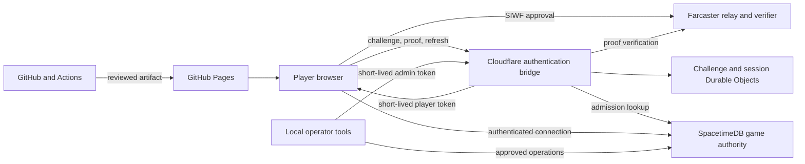

# Warpkeep threat model

## Status and scope

This document describes the current security model for Warpkeep Alpha 0.3.14. It
covers the browser application, Farcaster Sign In with Farcaster (SIWF), the Cloudflare authentication
bridge, SpacetimeDB game authority, local operator tools, GitHub Actions, and GitHub Pages delivery.

Warpkeep is an invite-only alpha. It is not certified against OWASP ASVS and has
not received an independent penetration test. Security controls reduce risk; they do not make a browser,
extension, operator workstation, or external provider trustworthy.

The current deployment uses authentication contract v2 and backend protocol 3. Genesis 001 and player
resources are persistent server state. The browser is a presentation client and never decides admission,
identity, ownership, resource balances, timers, or game outcomes.

## System overview

The bridge verifies the Farcaster proof and asks SpacetimeDB whether the FID is admitted before issuing a
player token. SpacetimeDB independently validates the token and enforces authorization on every protected
operation. Anonymous visitors do not connect to the game database.

## Assets to protect

| Asset | Security requirement |
| --- | --- |
| Farcaster identity binding | A browser-supplied FID or profile field must never become identity authority. |
| SIWF proof and relay data | Confidential in transit and logs, short-lived, context-bound, and single-use. |
| Player access token | Memory-only in the browser, short-lived, and limited to the admitted FID. |
| Session family | Server-side rotation and revocation; browser reference is Secure, HttpOnly, and SameSite=Strict. |
| Signing and operator secrets | Managed outside source, build artifacts, browser code, command output, and logs. |
| Admission and ownership records | Private, server-authorized, and absent from public browser subscriptions. |
| Terms acceptance | Private versioned evidence; never contains proof, token, cookie, or QR material. |
| Player resources and Marks | Private balances and accounting; only the authenticated caller may read permitted projections. |
| World and castle state | Transactional integrity and server-enforced ownership. |
| Deployment authority | Least privilege, reviewed changes, protected branches, and reproducible artifacts. |
| Player privacy | Minimum collection, bounded presentation fields, redacted diagnostics, and private operational records. |

## Trust boundaries

1. **Browser to Farcaster.** Relay responses are untrusted until the bridge verifies the completed proof.
2. **Browser to authentication bridge.** Request bodies, headers, origins, and proof material are hostile
   input. The bridge applies strict schemas, size limits, deadlines, origin checks, and replay protection.
3. **Bridge to Farcaster verifier.** Two independent production RPC origins
   must both validate the proof to the same FID. Failure, partial success,
   disagreement, or malformed responses must not produce a token.
4. **Bridge to SpacetimeDB.** Admission lookup uses a short-lived resolver principal bound to one FID and
   fixed service coordinates.
5. **Browser to SpacetimeDB.** The module repeats issuer, audience, subject, role, epoch, expiry, admission,
   and ownership checks. Frontend gating is not an authorization boundary.
6. **Operator to production services.** Admin credentials may be sent only to allowlisted Warpkeep
   endpoints. Mutations require explicit approval, preconditions, and postconditions.
7. **GitHub Actions to Pages.** Only the deployment job receives Pages and OIDC write access.
8. **Public repository to local operations.** Secrets, private reports, identities, and production evidence
   remain in approved secret stores or private records.

## Threat actors

- anonymous or non-admitted visitors;
- malicious admitted players;
- attackers replaying proofs, cookies, tokens, or parallel requests;
- origin-spoofing clients and automated resource-exhaustion traffic;
- script injection, malicious extensions, or a compromised player device;
- malicious dependencies, registry artifacts, pull requests, or CI steps;
- compromised external providers or network paths;
- misconfigured or compromised operator workstations and cloud accounts.

## Core controls

### Identity and admission

- The bridge derives the decimal FID from an independently verified SIWF proof. Usernames, portraits,
  wallet links, and browser parameters are presentation data only.
- SIWF validation binds the proof to the configured domain, URI, nonce, request, and expiry. The proof FID
  and requested FID must agree.
- Production runs the official verifier against two distinct public HTTPS RPC
  origins and requires matching successful FIDs. One loopback endpoint is
  accepted only in an explicit development profile.
- Challenges are random, expire, and are claimed atomically. Successful or definitively invalid exchanges
  consume them.
- Missing, disabled, malformed, or epoch-mismatched admission returns no access token or game state.
- Player, resolver, and administrator principals have separate subjects, roles, and protected paths.
- SpacetimeDB derives the caller from token claims; protected operations do not accept a caller FID as authority.

### Tokens and sessions

- Player access tokens use ES256, remain in JavaScript memory, and have a maximum 600-second session
  window. They are not stored in localStorage, IndexedDB, URLs, or browser-readable cookies.
- Continuity uses a server-side family referenced by
  `__Host-warpkeep_session; Secure; HttpOnly; SameSite=Strict; Path=/`.
- Refresh rechecks admission and authorization epoch, rotates the family, and narrowly limits replay recovery.
- Logout revokes the family, expires the cookie, clears client state, and closes the game connection.
  Failure to confirm revocation returns a generic error and still expires the current browser cookie.
- A non-secret logout marker blocks automatic restoration; only explicit Terms-gated sign-in may clear it.
- Resolver tokens are server-only, short-lived, restricted to admission lookup, and bound to one FID.
- Protected module operations recheck token expiry even when a transport outlives the original token.

### Data authority and privacy

- SpacetimeDB owns admission, player ownership, castles, world state, resource
  accounts, Marks, timers, and state transitions.
- Public tables expose only the projections required for shared-world display.
  Whitelists, opaque ownership identities, resources, Terms evidence, wallet
  attribution, receipts, audit records, and operator state remain private.
- Browser bindings and subscriptions omit private-table accessors. A public
  projection is never treated as permission to mutate its underlying state.
- The legacy public `player` schema is retained for compatibility but is not
  used by current clients or authorization code. A nonzero legacy row count is
  a hard stop for schema publication because the row shape includes an opaque
  identity field.
- Existing players require consistent public player, private ownership,
  admission, castle, and founding records. Partial or contradictory graphs fail
  closed rather than being repaired from browser data.
- Resource reads and collection are caller-scoped. Peer balances do not enter
  the public Realm subscription, and the browser applies no optimistic credit.
- Terms acceptance is recorded only after authenticated, explicit acceptance
  of the current version. The pre-authentication checkbox is local to one
  dialog attempt and is discarded on cancellation or failure.
- Public Farcaster presentation is sanitized and optional. A tab cache may hold
  only public display fields, may merge only after a successful same-FID
  refresh, and never restores authority.

### Input, transport, and abuse controls

- Network inputs use strict schemas, byte limits, UTF-8 decoding, content-type
  checks, explicit timeouts, and bounded response parsing.
- Credential-bearing requests reject redirects and unknown destinations.
  Production endpoints, issuer, audience, and database coordinates are pinned.
- Browser routes use an allowlist CORS policy and never wildcard credentials.
  Server-only routes reject browser origins.
- Credential routes use distributed rate limits and expiry cleanup. Per-client
  limits reduce abuse but do not replace account-level monitoring and quotas.
- Remote profile images are HTTPS-only, credential-free, redirect-free, and
  bounded by transfer size, time, dimensions, decoded pixels, and static image
  formats. Failure preserves a local fallback.
- Public error messages and logs omit proof material, tokens, cookies, QR
  payloads, relay secrets, identities, private rows, and credentialed URLs.

### Operations and software supply chain

- Worker secrets are stored in managed secret storage. Signing, session, and
  administrator keys are independent and must not be reused.
- Operator tools read credentials from approved local secret storage, restrict
  destinations, avoid command-line secret arguments, and use short-lived admin
  tokens.
- Production mutations are separate, explicit decisions. Schema publication,
  data migration, secret changes, service deployment, admission changes, and
  public enablement do not authorize one another.
- SpacetimeDB publications must be additive and prohibit data deletion. Any
  unexpected schema, count, ownership, or world-state result stops the process;
  an indeterminate result receives read-only investigation before retry.
- Production configuration defaults to disabled access. Enablement follows
  reviewed deployment and read-only health/configuration checks.
- GitHub workflows use minimal job permissions, immutable action references,
  disabled checkout credential persistence, dependency locks, and protected
  `main` checks. Deployment authority is isolated from ordinary verification.
- Release verification binds the deployed site to a reviewed commit SHA.
  Passing local tests alone does not authorize a deployment or data change.

## Principal risks and treatment

| Risk | Treatment and remaining exposure |
| --- | --- |
| Client substitutes another FID | Dual-RPC proof consensus and module-side caller derivation prevent browser choice; correlated provider or verifier-library compromise remains an external incident. |
| Proof or session replay | Expiring challenges, atomic claim, rotation, epoch checks, and revocation limit replay; host compromise can still defeat the boundary. |
| Access token stolen by script or extension | Memory-only storage and short lifetime limit exposure, but a compromised origin or device can use the token until expiry. |
| Resolver token stolen while fresh | One-FID binding and least-privilege guards limit access; a fresh token may still expose that FID's admission status and public subscriptions until disconnect. |
| Private data exposed through schema drift | Private tables, generated-binding checks, aggregate preflight, and the empty legacy table requirement block known paths; every schema change needs renewed review. |
| Spoofed profile or wallet data | Browser fields are presentation-only; trusted updates use separate operator paths. External source data may still be stale or incorrect. |
| External avatar tracking | No-referrer, credential-free requests reduce data sent, but the image host still observes connection metadata. |
| Resource exhaustion | Size limits, deadlines, early challenge claim, cleanup, and rate control reduce cost; aggregate monitoring and alerting remain limited. |
| Dependency or CI compromise | Lockfiles, audits, checksum and action pinning, job separation, and branch protection reduce exposure; provider compromise remains possible. |
| Operator compromise | Destination allowlists, short-lived tokens, private secret storage, and approvals reduce blast radius; a compromised operator account or workstation remains a critical incident. |
| Misleading Marks or Alpha expectations | Product copy states that Marks are non-transferable and have no cash value or guaranteed reward; formal legal and privacy review remains necessary as use expands. |

## Residual risks and current limitations

- XSS, a malicious extension, or a compromised device can act with the current
  player token until its short expiry. HttpOnly continuity does not make a
  compromised origin safe.
- The resolver lifecycle is constrained by SpacetimeDB procedure execution. A
  resolver credential presented while fresh may establish public subscriptions
  that persist until transport disconnect, although protected calls recheck
  expiry and it has no player mutation, private-table, or admin authority.
- Public Realm projections are observable to admitted clients by design.
  Privacy classification and retention must be revisited before adding new
  player-linked data.
- Hosting-layer security headers, including HSTS, require ongoing deployment
  verification. The production CSP keeps exact source and egress allowlists,
  but SpacetimeDB 2.6.1 requires a narrowly scoped `script-src 'unsafe-eval'`
  compatibility exception for typed serializer construction. Remove it when
  the client SDK no longer uses dynamic functions; until then, it increases
  the impact of any same-origin script compromise.
- Per-client rate limits do not prevent distributed traffic from reaching
  provider or account quotas. Monitoring, alerting, and incident drills remain
  areas for improvement.
- Third-party services—including both configured Farcaster RPC providers,
  Farcaster, Cloudflare, GitHub, package
  registries, and SpacetimeDB—are trusted dependencies and are not audited by
  this project.
- Branch protection and automated checks reduce supply-chain risk but do not
  replace independent review. Required commit signatures are not currently
  enforced.
- Alpha Terms and privacy text are project-authored and do not replace formal
  legal or privacy review.

## Assumptions

- Managed secret stores do not expose private material to Pages builds or
  untrusted pull requests.
- Farcaster verification correctly binds a valid proof to its FID.
- SpacetimeDB enforces token signature validation and transaction semantics as
  documented for the deployed version.
- Operators follow the approval-gated runbooks, use privacy-safe aggregate
  checks, and never use destructive database flags.
- Public authentication and shared Realm entry can be disabled independently
  for containment.

## Review triggers

Review this model before:

- widening admission or making the game publicly accessible;
- changing SIWF, token, cookie, session, resolver, or authorization policy;
- adding a trusted origin, external provider, database, or deployment platform;
- changing public/private table visibility or adding player-linked data;
- adding a resource, economy, wallet, combat, moderation, or social mutation;
- adding an administrator or automated operator entry point;
- changing CI permissions, branch protection, release signing, or deployment;
- changing production security headers, CSP, logging, monitoring, or retention;
- responding to a credential, provider, dependency, privacy, or production
  incident.

This document records defensive expectations. It does not approve a production deployment, schema
publication, secret change, data mutation, admission change, or public enablement.
