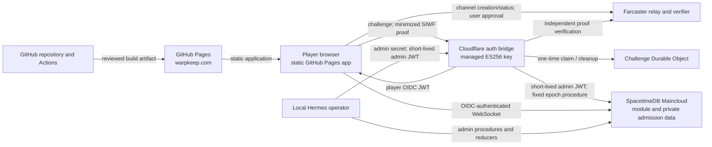

# Warpkeep Alpha 0.2 Threat Model

Status: living pre-release model for the closed Alpha 0.2 architecture. It is
not an OWASP ASVS certification or a penetration-test attestation.

## Scope and revision

This model covers the browser experience, Farcaster Sign In with Farcaster
(SIWF), the Cloudflare authentication bridge, SpacetimeDB authorization, local
Hermes administration, and the GitHub Pages delivery path.

- Runtime audit base: `2e9f3cfe9eb3f04c37156fb6cf2b82377ad616cc`
- Runtime branch: `feat/spacetimedb-basic-connection` (PR #11)
- Licensing-policy review: `f57d252e56d6d3abf1530d12997815c5b1466e35`
  (PR #15), reviewed separately from the runtime branch
- Intended public frontend: `https://warpkeep.com/`
- Intended OIDC issuer: `https://auth.warpkeep.com`
- Intended database service: SpacetimeDB Maincloud

The model assumes a deliberately small, invite-only alpha. It does not treat
the current 30-day browser bearer session, early abuse controls, or operational
history as production-grade.

## System and data flow

The browser may request identity proof, but it does not choose the authoritative
FID. The bridge independently verifies the proof and obtains the current
authorization epoch from a fixed server-to-server procedure before issuing a
player token. SpacetimeDB remains authoritative for admission, player/castle
creation, and world state. Anonymous visitors do not open a database connection.

## Assets

| Asset | Required protection |
| --- | --- |
| Farcaster FID identity binding | Integrity; a client-supplied FID must never become authority. |
| SIWF message and signature | Confidentiality in transit and logs; strict contextual validation; single use. |
| Relay channel token, channel URL, nonce, and request ID | Confidentiality, bounded lifetime, and no persistence beyond the active flow. |
| Player OIDC JWT | Confidentiality; exact claims; expiry and epoch enforcement; teardown on logout. |
| Worker-to-SpacetimeDB admin JWT | Server-only, short-lived, in-memory, fixed destination, never logged. |
| ES256 private signing key | Worker-managed secret only; absent from source, browser, artifacts, and logs. |
| Hermes admin secret | Operator/Worker secret only; never placed in browser code, process output, or repository. |
| Farcaster/Optimism RPC credential | Worker secret only; URL and credential must not be logged or returned. |
| Cloudflare account and Worker | Deployment and configuration integrity; least privilege. |
| SpacetimeDB identity and claims | Exact issuer, audience, token type, subject, role, FID, epoch, and time validation. |
| Private whitelist and admin audit data | Server-only confidentiality and authorized mutation. |
| Persistent player, castle, and world state | Transactional integrity and module-authoritative ownership. |
| Remembered-device record | Local confidentiality; strict parsing, expiry, logout propagation, and minimum data. |
| GitHub deployment authority | Least privilege, immutable workflow dependencies, reviewed artifact provenance. |
| Pages custom domain | HTTPS integrity, canonical redirects, and controlled deployment. |
| Local operations machine | Separation from public repository content and protection of operator credentials. |

## Trust boundaries

1. **Browser ↔ Farcaster relay/client.** Channel creation and approval data are
   untrusted until independently verified. A relay response is not itself an
   identity assertion.
2. **Browser ↔ auth bridge.** All request fields, headers, origins, proof data,
   and profile metadata are hostile input. TLS, exact CORS policy, strict size
   bounds, contextual proof checks, and replay protection apply.
3. **Worker ↔ Farcaster verifier / Optimism RPC.** The endpoint and credential
   are server configuration. Responses may fail, stall, or be malformed and
   must not produce a token on error.
4. **Worker ↔ SpacetimeDB HTTP procedure.** A privileged ephemeral token crosses
   this boundary. The HTTPS origin, database, procedure, redirects, time, body
   size, content type, and response shape are constrained.
5. **Browser ↔ SpacetimeDB Maincloud.** The browser presents a bearer token.
   Every sensitive procedure/reducer must repeat module-side authorization;
   frontend gating is not a security boundary.
6. **Hermes ↔ Worker admin endpoint.** Browser origins are rejected. The
   long-lived admin secret may be sent only to the canonical bridge, which
   returns a short-lived, narrowly shaped admin JWT.
7. **Hermes ↔ SpacetimeDB admin surfaces.** The short-lived token may be sent
   only to the canonical Maincloud origin/database. Admin role and subject are
   distinct from player authority.
8. **GitHub Actions ↔ Pages.** Dependency-running build jobs are untrusted with
   deployment authority. Only the deploy job receives Pages and OIDC write
   permissions, and it consumes the built artifact.
9. **Public repository ↔ local operations machine.** Repository scripts and
   documentation are public and must contain no credential material. Local
   secret stores and private reports remain outside the repository.

## Attacker classes

- anonymous browser user;
- valid but non-whitelisted Farcaster user;
- malicious whitelisted player;
- bearer-token holder after browser storage or device compromise;
- XSS or malicious-extension attacker operating in the application origin;
- replay and parallel-request attacker;
- origin-spoofing non-browser client;
- availability, quota, and cost attacker;
- compromised package, package registry path, or downloaded tool;
- malicious pull-request contributor or compromised GitHub Action;
- on-path network attacker before transport policy is established;
- misconfigured or compromised operator environment.

## Security properties and controls

### Identity and proof

- A decimal FID is derived from the independently verified Farcaster proof, not
  a browser display field or reducer argument.
- SIWF context is bound to the configured domain, URI, nonce, request ID, and
  expiration before a token can be issued.
- The proof FID, requested FID, and optional profile FID must agree.
- Profile fields are bounded presentation metadata, not identity authority.
- Proof material, relay secrets, tokens, credentialed URLs, and private
  responses are excluded from logs and public error messages.

### Replay and resource control

- Challenges are random, expire, and are atomically claimed before expensive
  verification, database lookup, or signing.
- A successful or definitively invalid exchange consumes the challenge. Only
  an explicitly retryable verifier outage, epoch lookup failure, or signing
  failure restores a still-live challenge.
- Durable Object storage is alarm-cleaned and deallocated after use or expiry.
- Request and response bodies are streamed through byte bounds with strict text
  decoding. The browser bridge exchange, Worker epoch lookup, and local Hermes
  connection/operation paths use explicit deadlines.
- Distributed sequential abuse still requires deployment-level rate limiting
  and monitoring before wider availability.

### Tokens and authorization

- Player and admin tokens use ES256 and distinct exact subject/role shapes.
- SpacetimeDB verifies the token signature and standard time claims when the
  connection is authenticated. The module then validates issuer, audience,
  token type, subject, roles, FID, and epoch. A player cannot use an admin
  surface and an admin token cannot bootstrap as a player.
- Signed `session_iat`/`session_exp` claims preserve the original player-session
  window across SpacetimeDB's temporary connection-token exchange. Every player
  module call rechecks that maximum-30-day absolute deadline against module time.
- Admin reducer/procedure entry points recheck the connection JWT expiry
  against authoritative reducer time, even when a WebSocket outlives token
  expiry.
- Player admission and the authorization epoch are module-authoritative.
  Denied admission creates no player or castle state.
- Private whitelist and admin-audit tables are omitted from public generated
  bindings and subscriptions.

### Browser session lifecycle

- The remembered record has a documented absolute maximum of 30 days and is
  strictly parsed against issuer, audience, subject, FID, and timestamps.
- A restored bearer is moved into transient runtime state rather than retained
  in immutable component initialization state.
- Logout clears the local record, pending auth state, and database connection;
  a non-sensitive same-origin signal propagates logout to other tabs.
- The browser receives only minimum display identity fields; proof, custody,
  verification, and authentication-method details do not enter the game view.
- This self-contained localStorage bearer cannot be remotely invalidated merely
  by deleting one browser copy. Epoch bump/signing-key response and expiry are
  the available revocation controls for copied tokens.

### Operations and delivery

- Hermes credential-bearing operations allowlist the canonical bridge,
  Maincloud origin, and database. Custom destinations are limited to secret-free
  dry runs.
- Admin requests reject redirects and use connection, operation, and child
  process deadlines with cleanup.
- Workflow actions are pinned to reviewed immutable commits. Checkout
  credentials are not persisted, downloaded SpacetimeDB binaries are pinned by
  release checksum, and all package boundaries are audited.
- Build jobs have read-only repository access. Pages and OIDC write authority is
  isolated to the deployment job.
- The frontend shared-alpha switch defaults off so an incomplete identity chain
  fails closed.

## Principal threat scenarios

| Threat | Primary control | Residual treatment |
| --- | --- | --- |
| Client chooses or substitutes another FID | Independent SIWF verification and exact FID agreement | Treat verifier/RPC compromise as an external dependency incident. |
| Proof replay or parallel exchange | Expiring Durable Object challenge and atomic pre-work claim | Add edge/Worker rate limits for distributed sequential abuse. |
| Stolen browser bearer | Exact claims, module-enforced absolute lifetime, epoch checks, disconnect/logout handling | Accepted closed-alpha risk; move to short-lived access plus trusted HttpOnly refresh for production. |
| Admin credential exfiltration through operator target override | Canonical destination allowlist and secret-free custom dry run | Operator host compromise remains out of application scope. |
| Admin WebSocket remains privileged after JWT expiry | Reducer/procedure-side expiry check using authoritative time | Ensure every future admin entry point calls the common guard. |
| Whitelist bypass or private-row disclosure | Module-side admission on every protected operation; private tables/bindings | Public world/player/castle projections remain intentionally observable. |
| Worker memory/cost exhaustion | Streaming bounds, timeouts, early challenge claim, storage cleanup | Deployment-level quotas, rate limits, and telemetry are still required. |
| Malicious dependency or workflow step obtains deployment authority | Lockfiles, audits, action SHA pins, checksum verification, job privilege split | Repository settings and alert operations require ongoing owner review. |
| First-visit transport downgrade or framing/content-type hardening gap | HTTPS redirect and browser-origin validation | HSTS and response headers depend on the hosting layer and remain an activation check. |
| Misconfigured partial activation | Default-off frontend switch and exact issuer/origin/database validation | Follow the activation runbook and verify discovery/JWKS/module agreement before enabling. |

## Accepted alpha risks and future requirements

- The 30-day bearer in localStorage is vulnerable to origin-level script,
  extension, or device compromise and lacks an HttpOnly refresh/session tier.
- A copied self-contained player token is not revoked by browser logout. Epoch
  bump, key response, and the module-enforced absolute expiration are the
  available controls.
- A baseline-epoch token obtained before first admission can become usable when
  that FID is first allowed. Re-enabling a disabled record without changing its
  epoch can likewise reactivate an older same-epoch token. Changing either
  behavior is a whitelist-policy decision and should be resolved before broader
  access.
- Public game projections allow any connected authenticated client, including
  an unadmitted player using a custom client, to observe world/player/castle
  data by design; privacy classification must be revisited as state expands.
- Optional caller-supplied display metadata is not a verified profile claim and
  must not be used for authority or high-trust presentation.
- Static Pages responses currently lack several defense-in-depth headers,
  including HSTS. Hosting-layer header support or a fronting service is a future
  production requirement.
- Edge rate limiting, alerting, key-rotation drills, incident response, and
  operational history are not yet mature enough for production assurance.
- The GitHub `main` branch currently has no protection or ruleset. Required
  reviews/checks and tightly scoped bypass permissions remain owner-side release
  controls even with hardened workflows.

## Assumptions and operational dependencies

- Cloudflare keeps the signing key, RPC credential, and admin secret in managed
  secret storage and never exposes them to Pages or untrusted pull requests.
- Farcaster's official verifier correctly binds the signature to the FID.
- SpacetimeDB Maincloud and version 2.6.1 enforce the documented JWT signature
  verification and transaction semantics.
- The configured issuer, public discovery/JWKS, Worker key, module trust, and
  frontend values are deployed atomically enough to fail closed during rollout.
- GitHub environment and branch policies restrict production deployment to the
  intended branch even though repository branch protection remains an owner
  configuration concern.
- Operators do not pass secrets on command lines, store returned JWTs, or run
  destructive publish/database commands outside the reviewed runbook.

## Exclusions

This review does not authenticate to Cloudflare or SpacetimeDB, inspect the
owner's Keychain, retrieve or rotate production secrets, mutate Maincloud or
whitelist data, approve a real SIWF request, perform high-volume production
testing, audit Farcaster/Cloudflare/GitHub/SpacetimeDB internals, or assess game
art, layout, and unrelated gameplay design.

## Review triggers

Revisit this model before widening admission, changing token/session policy,
adding a new trusted origin or database, introducing gameplay mutations or
private player data, adding an admin entry point, changing the deployment
workflow, or moving away from the current Pages/Worker/Maincloud topology.
