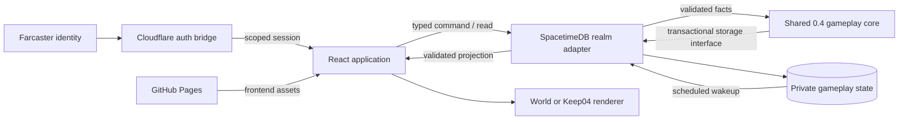

# Technical architecture

Warpkeep separates player identity, game rules, persistent state and presentation.
The browser renders a world and offers decisions; SpacetimeDB decides what those
decisions do. Cloudflare provides the identity bridge and a separate release
recovery service. GitHub Pages serves the frontend.

This document explains those relationships and the current implementation. The
[repository map](agent-notes/0.4.0/repo-map.md) links individual source and test
entry points. Dated verification and deployed state belong in the
[execution handoff](agent-notes/0.4.0/execution-handoff.md) and
[delivery journal](operations/0.4.0-live-delivery-status.md).

## Runtime responsibilities

| Component | Responsibility | Principal boundary |
| --- | --- | --- |
| React application | Entry, realm selection, navigation, decisions and accessible fallback | Presents validated state; does not grant admission or resources |
| Three.js presentation | World/keep geometry, animation, loading and graphics lifecycle | Decorative geometry does not determine routes, placement validity or yield |
| Cloudflare auth bridge | Verify Farcaster identity and issue narrowly scoped sessions | Authentication and realm entitlement are separate decisions |
| SpacetimeDB realm module | Authenticate each operation, resolve world facts, transact and schedule | Derives owner, database, atlas, time and economic outcomes on the server |
| Shared 0.4 gameplay core | Deterministic policy, transitions, arithmetic and validation | Uses storage interfaces; does not depend on browser, network or database SDK |
| Release tooling and recovery service | Build provenance, deployment authorization and reconciliation | Deployment authority is separate from player authority |

The browser is hosted at `warpkeep.com`, the auth bridge at `auth.warpkeep.com`.
G001, G002 and PTR use distinct database identities. Provider configuration and
live observations are documented in [infrastructure access](operations/0.4.0-infra-access.md).
A checked-in endpoint or successful CLI login does not establish that every
component has been deployed or that a player has access to a realm.

## Realm separation and gameplay generations

**Genesis 001** is the established 0.3 world. Its server authority lives in
[`spacetimedb/src/`](../spacetimedb/src/index.ts), and its browser provider and
renderer remain separate from the new keep. The compiled
[access policy](../spacetimedb/src/genesis001AccessPolicy.ts) keeps existing player
access while closing admission mutations and new requests. Existing gameplay
continues to change state; preserving the world means preserving its behavior and
player records, not expecting an idle database or restoring an old snapshot.

**0.4 gameplay** lives in [`spacetimedb/gameplay04/`](../spacetimedb/gameplay04/policy.ts).
It implements the gather → choose → build → benefit → return loop through storage
interfaces. Realm adapters provide authentication, atlas topology and an atomic
transaction. Keep identity includes the immutable database identity and owner;
G001 balances or ownership do not become 0.4 state through a client-side mapping.

**PTR** is the owner test realm with functioning adapters for initialization,
state reads, dispatch, recall and construction. Its
[owner guard](../spacetimedb/ptr/src/auth.ts) checks fresh scoped claims against
the actual database and enabled owner anchor. The ordinary owner, atlas
administrator and infrastructure administrator have different capabilities.

**Genesis 002** has its own private schema and the matching 0.4 interface, but its
[gameplay procedures](../spacetimedb/genesis002/src/gameplayKeep.ts) deliberately
reject before reading or writing gameplay storage. This is the sealed launch
behavior; admissions remain undecided. An interface and generated binding can
therefore exist without enabling a public player journey.

The generations use different economic rules:

| Concern | Preserved G001 authority | Current 0.4 core |
| --- | --- | --- |
| Gathering | Generic Workers coexist with retained legacy expedition compatibility; new legacy dispatch closes after Worker rollout | Duration-selected journeys reserve validated atlas location capacity |
| Spendable resources | Passive settlement and Worker accrual can materialize into the private account during a journey | Earned cargo becomes spendable on authoritative return; credited and overflow amounts are recorded |
| Construction | Dormant legacy Inner Keep policy emphasizes construction discounts | Economy buildings improve future matching yield; Barracks improves travel; Cathedral improves future construction time |
| Policy capture | Defined by the retained resource/Worker authority | Journey and project terms are captured when accepted; later building completion does not rewrite them |

Exact tuning belongs in [0.4 policy](../spacetimedb/gameplay04/policy.ts) and the
[gameplay specification](superpowers/specs/2026-09-05-warpkeep-0.4-gameplay-design.md),
not in duplicated architecture tables. The older
[Inner Keep V1 document](design/inner-keep-construction.md) describes G001-oriented
work and is not the 0.4 construction contract.

## A 0.4 command from selection to persistent result

The connected browser route runs through
[`WarpkeepExperience`](../src/components/WarpkeepExperience.tsx),
[`PtrRealmProvider`](../src/ptr/PtrRealmProvider.tsx) and
[`PtrGameplay04SurfaceHost`](../src/ptr/PtrGameplay04SurfaceHost.tsx).
The provider obtains a scoped owner session and constructs the narrow atlas and
gameplay capabilities in [`ptrRealmConnection.ts`](../src/ptr/ptrRealmConnection.ts).
Views receive those capabilities rather than arbitrary RPC or credentials.

1. A world selection supplies a resource location and atlas revision. A keep
   selection supplies a building quote and placement. The
   [controller](../src/ptr/gameplay04/createGameplay04Controller.ts) captures the
   next command sequence, request key, expected state revision and the relevant
   policy, atlas and quote assertions.
2. The connection capability calls the generated PTR procedure and checks its
   session scope before and after asynchronous work. The
   [wire types](../src/ptr/gameplay04/ptrGameplay04Types.ts) derive from the actual
   generated procedure signatures.
3. The realm adapter authenticates inside `ctx.withTx`. For dispatch,
   [`gameplayWorkers.ts`](../spacetimedb/ptr/src/gameplayWorkers.ts) resolves the
   actual destination, resource, location capacity and connected route from the
   ready private atlas. The client does not supply an authoritative route or rate.
4. The core checks the command receipt and sequence, reconciles due work for a
   fresh command, validates the new action and commits state with its receipt.
   Construction similarly verifies the quoted cost, duration, target and permanent
   transform in [`construction.ts`](../spacetimedb/gameplay04/construction.ts).
   A rejected transaction cannot leave partial reconciliation or deductions.
5. The returned receipt confirms the accepted sequence/revision. The controller
   rereads authoritative state; the
   [decoder](../src/ptr/gameplay04/gameplay04State.ts) validates it before the UI
   receives a new immutable presentation.

The [command protocol](../spacetimedb/gameplay04/commands.ts) retains bounded exact
receipts and a monotonic accepted sequence. An identical retained retry returns
its original result. Conflicting payloads reject; an old pruned sequence rejects
rather than executing again. An unknown network outcome retains the original
request envelope. A stale quote triggers a new read and a new player confirmation,
not an automatic resubmission with changed terms.

Timers use the same authoritative core. The
[scheduled adapter](../spacetimedb/ptr/src/gameplaySchedule.ts) validates the exact
persisted wakeup, assignment/project revision, owner and database before
reconciling. An authenticated
[state read](../spacetimedb/ptr/src/gameplayKeep.ts) can also reconcile overdue
work. [`reconciliation.ts`](../spacetimedb/gameplay04/reconciliation.ts) completes
due construction and Workers in one transaction and advances the state revision
when anything changed. Browser clocks animate progress but cannot credit cargo
or complete a building.

## State, sessions and privacy

The 0.4 private schema stores the keep/resource account, Workers, command
receipts, location reservations, buildings, active project and scheduled wakeups.
Its definitions live in each realm's `gameplaySchema.ts`; storage adapters decode
and validate persisted rows before calling the core. Public map presentation comes
through bounded atlas procedures, not subscriptions to private population or
resource authority tables.

The [auth bridge](../services/auth-bridge/README.md) verifies ordinary-browser
Sign In with Farcaster and Mini App Quick Auth through distinct entry paths.
Browser session rotation and cookie-free Mini App exchange both end in scoped
credentials which the database verifies again. FID identifies the player;
usernames, portraits and Mini App context supply presentation, not entitlement.

Realm, session, database and authentication-epoch changes retire incompatible
connections, caches and pending capabilities. The controller separately retires
in-flight reads on disposal. Healthy refresh retains the last validated scene
while commands are unavailable; failed or ambiguous refresh does not restore
write authority from cached state. Expiry, delayed responses, unknown outcomes
and return navigation are part of the connected lifecycle, not only error copy.

An owner already inside PTR can renew at hard expiry through fresh Quick Auth,
same-FID/database/epoch verification and a new connection/preflight. Renewal
removes the expired surface; only the world/keep destination and an interrupted-
action notice survive. Fresh state decides the outcome, and commands are never
replayed across leases. Menu admission remains an explicit access/entry flow.
See [session continuation evidence](evidence/0.4.0/isolation-lifecycle.md) for
verified behavior and the remaining actual-owner/foreground identity coverage.

G001 Chat, Marks, notifications, observers and canaries retain their own authority
and activation rules. They are not implicitly enabled by the new keep. Private
identity proofs, balances and operational receipts do not belong in rendering
props or public diagnostics. See the [threat model](security/threat-model.md).

## World and keep presentation

[`PtrGameplay04SurfaceHost`](../src/ptr/PtrGameplay04SurfaceHost.tsx) selects mutually
exclusive world and keep surfaces. The invariant is one active canvas/renderer
with correct disposal and session ownership; the new route does not promise to
reuse one renderer instance across every world/keep switch.

The world route passes through
[`GreaterRealmWorldScene`](../src/components/realm/GreaterRealmWorldScene.tsx), its
[canvas host](../src/components/realm/createGreaterRealmWorldCanvasHost.ts), and
[`createGreaterRealmSceneRuntime.ts`](../src/greater-realm/createGreaterRealmSceneRuntime.ts).
The atlas bridge, chunk stream and presentation plan connect bounded server data
to the visible scene. That runtime owns the actual 0.4 world water, using
[`greaterRealmWaterSurface.ts`](../src/greater-realm/greaterRealmWaterSurface.ts)
for a single lit surface with world-coordinate waves and a shared host clock.
Water polygons fill only explicitly returned wet hexes; shading does not move
their authoritative surface heights. G001's
[`realmWaterLayer.ts`](../src/components/realm/realmWaterLayer.ts) belongs to its
preserved renderer and is a reference, not an already connected 0.4 water layer.

The keep route uses [`Keep04Screen`](../src/components/keep04/Keep04Screen.tsx) for
decisions and accessible schematic fallback, then
[`Keep04SceneHost`](../src/components/keep04/Keep04SceneHost.tsx) for canvas lifecycle.
Scene composition, building fallbacks, asset loading, visual profile and voxel
dressing are separate modules under `src/components/keep04/`. Shared meshing and
neutral utilities can be reused without importing legacy economic policy.

Hosts own asynchronous loaders, animation frames, event listeners, context
recovery and resource disposal. Quality, hidden-page and reduced-motion policies
bound optional work. Scenery, forest and water do not create server navigation,
collision or harvesting authority. Generated dressing plans are reproducible;
asset provenance remains attached to reused models regardless of the new art
direction. Visual correctness and performance need rendered workloads in addition
to scene-graph tests; the measurement record is
[performance evidence](evidence/0.4.0/performance.md).

## Build, publication and recovery

Source publication, candidate assembly and production deployment are separate
operations. The root [build script](../package.json) performs generated-plan,
type, asset, Vite and public-output checks. A direct Vite build covers only part of
that contract. Auth bridge, database modules and recovery service each have their
own package scripts, lockfiles and deployment boundary.

The local Windows/WSL preparation components build bindings and fixed operation
bundles from committed source. A
[matched-artifact coordinator](../scripts/local-release-artifact-inputs.mjs)
requires producer commit/tree identities to agree. The
[closure derivation](../scripts/local-prepared-closure-family.mjs) derives dependent
inventories and source pins. The
[workspace manager](../scripts/local-release-workspace.mjs) separates immutable
builder source from a locked candidate, and transactional installation/recovery
handles generated candidate files. This filesystem recovery is distinct from
recovering a live database while retaining writes made after deployment.

The Cloudflare recovery service has an HTTP
[gateway](../services/release-recovery/src/index-gateway.ts), a private service-bound
[signer](../services/release-recovery/src/index-signer.ts), independently retrieved
GitHub/realm evidence, and a Durable Object authorization ledger. Its issue,
claim, completion and reconciliation operations bind source, artifacts and a real
workflow execution. A digest alone does not establish who produced evidence.

The source currently exposes specific integration gaps, rather than one finished
release command:

- Full local assembly is exercised by a native fixture; the component APIs are
  not yet a production assembler entry point. The
  [compiled-family probe](../tests/fixtures/localReleaseCompiledFamilyNativeProbe.mjs)
  shows the composition and the
  [assembler specification](superpowers/specs/2026-09-06-warpkeep-local-release-assembler-design.md)
  describes the intended operating interface.
- The [activation workflow adapter](../scripts/sealed-realms-production-activation-workflow-entry.mjs)
  still supplies unavailable attesters for deployment/binding/import/owner facts.
- The [Pages workflow](../.github/workflows/deploy-pages.yml) now supplies the
  signer's `deploy-recovery` caller with the defined Linux/WSL identity and
  claim → fresh boundary → deployment → postflight sequence. Its actual runner,
  private runtime state, installed generated bundle/manifest, final source family
  and live authorization
  remain unprepared or unverified. Other production lanes, including the
  [sealed-realms workflow](../.github/workflows/sealed-realms-production.yml),
  still retain Mac selections. The
  [release engineering record](evidence/0.4.0/release-engineering.md) distinguishes
  tested workflow composition from operating acceptance.

These are implementation interfaces to finish, not reasons to manufacture new
permission stages. Their current observed execution status and remaining evidence
belong in the [release audit](agent-notes/0.4.0/release-and-infrastructure.md) and
[release checklist](operations/0.4.0-release-checklist.md). Changing source or
passing component tests does not by itself update a hosted service or an existing
database.
